# अध्याय 1 — आसन (67 श्लोक / 15 प्रमुख आसन)

1. स्वस्तिकासन
2. गोमुखासन
3. वीरासन
4. कूर्मासन
5. कुक्कुटासन
6. उत्तानकूर्मासन
7. धनुरासन
8. मत्स्येन्द्रासन
9. पश्चिमोत्तानासन
10. मयूरासन
11. शवासन
12. सिद्धासन
13. पद्मासन
14. सिंहासन
15. भद्रासन

## अध्याय 1 का सारांश (logical grouping)

| समूह (Group) | श्लोक (Shloka) | विषय (Theme)                 | मुख्य विचार (Main Idea)                                                                                                                                           |
|--------------|----------------|------------------------------|-------------------------------------------------------------------------------------------------------------------------------------------------------------------|
| **1**        | 1-9            | **मंगलाचरण एवं गुरु परंपरा** | आदिनाथ शिव को नमन और हठयोग के सिद्धों की वंशावली                                                                                                                  |
| **2**        | 10-14          | **अभ्यास की तैयारी**         | योग मठ (कुटिया) का विवरण, स्थान और गोपनीयता का महत्व                                                                                                              |
| **3**        | 15-16          | **बाधक और साधक तत्व**        | योग को नष्ट करने वाले दोष और सफलता दिलाने वाले गुण; यम-नियम                                                                                                       |
| **4**        | 17-18          | **आसन परिचय**                | हठयोग के प्रथम अंग के रूप में आसन का महत्व और लाभ                                                                                                                 |
| **5**        | 19-32          | **प्रमुख आसन (भाग 1)**       | स्वस्तिकासन से लेकर शवासन तक विभिन्न (11) मुद्राओं की विधि और लाभ - स्वस्तिक, गोमुख, वीर, कूर्म, कुक्कुट, उत्तानकूर्म, धनुर, मत्स्येन्द्र, पश्चिमोत्तान, मयूर, शव |
| **6**        | 33-54          | **चार मुख्य आसन**            | भगवान शिव द्वारा बताए श्रेष्ठ चार आसन - सिद्ध, पद्म, सिंह और भद्रासन                                                                                              |
| **7**        | 55-63          | **मिताहार (आहार नियम)**      | योगी के लिए उपयुक्त (पथ्य) और वर्जित (अपथ्य) भोजन के निर्देश                                                                                                      |
| **8**        | 64-67          | **सफलता के सूत्र**           | अभ्यास की प्रधानता और राजयोग की प्राप्ति का अंतिम लक्ष्य                                                                                                          |

## (1/8 group) मंगलाचरण एवं गुरु परंपरा (1-9 / 67 श्लोक)

### ॥ १ ॥ श्रीआदिनाथाय नमोऽस्तु तस्मै येनोपदिष्टा हठयोगविद्या । विभ्राजते प्रोन्नतराजयोगमारोदुमिच्छोरधिरोहिणीव ॥ १ ॥

यह श्लोक **हठयोग प्रदीपिका** का प्रथम मंगलाचरण श्लोक है, जिसमें आदिनाथ (शिव) को नमन किया गया है:

| श्लोक का अंश                    | हिंदी अर्थ                                                                              |
|---------------------------------|-----------------------------------------------------------------------------------------|
| **श्रीआदिनाथाय नमोऽस्तु तस्मै** | उन श्री **आदिनाथ** (भगवान शिव) को मेरा नमस्कार है।                                      |
| **येनोपदिष्टा हठयोगविद्या**     | जिन्होंने **हठयोग** की विद्या का उपदेश दिया।                                            |
| **विभ्राजते प्रोन्नतराजयोग-**   | जो श्रेष्ठ **राजयोग** के शिखर पर।                                                       |
| **मारोदुमिच्छोरधिरोहिणीव**      | आरूढ़ होने (चढ़ने) की इच्छा रखने वालों के लिए **सीढ़ी** (अधिरोहिणी) के समान सुशोभित है। |

> राजयोग (समाधि/उच्चतम चेतना) की प्राप्ति के लिए हठयोग को एक आवश्यक आधार या प्रारंभिक सोपान के रूप में स्वीकार करें।

### ॥ २ ॥ प्रणम्य श्रीगुरुं नाथं स्वात्मारामेण योगिना । केवलं राजयोगाय हठविद्योपदिश्यते ॥

यह श्लोक **हठयोग प्रदीपिका** के उद्देश्य और लेखक के संकल्प को स्पष्ट करता है:

| श्लोक का अंश               | हिंदी अर्थ                                                    |
|----------------------------|---------------------------------------------------------------|
| **प्रणम्य श्रीगुरुं नाथं** | अपने गुरु श्री **आदिनाथ** (या मत्स्येंद्रनाथ) को प्रणाम करके। |
| **स्वात्मारामेण योगिना**   | **स्वात्माराम** नामक योगी के द्वारा।                          |
| **केवलं राजयोगाय**         | **केवल राजयोग** (परम समाधि) की प्राप्ति के लिए ही।            |
| **हठविद्योपदिश्यते**       | इस **हठविद्या** का उपदेश दिया जा रहा है।                      |

> हठयोग का अभ्यास केवल शारीरिक व्यायाम के लिए न करें, बल्कि इसे राजयोग (आत्म-साक्षात्कार) प्राप्त करने का
> साधन मानें।

### ॥ ३ ॥ भ्रान्त्या बहुमतध्वान्ते राजयोगमजानताम् । हठ प्रदीपिकां धत्ते स्वात्मारामः कृपाकरः ॥

इस श्लोक में स्वात्माराम योगी ने हठयोग प्रदीपिका की रचना का कारण और इसकी उपयोगिता स्पष्ट की है:

| श्लोक का अंश                 | हिंदी अर्थ                                                                  |
|------------------------------|-----------------------------------------------------------------------------|
| **भ्रान्त्या बहुमतध्वान्ते** | विभिन्न मत-मतांतरों के अंधकार (**ध्वान्ते**) और **भ्रांति** (भ्रम) के कारण। |
| **राजयोगमजानताम्**           | जो लोग वास्तविक **राजयोग** के मार्ग को नहीं जान पा रहे हैं।                 |
| **हठप्रदीपिकां धत्ते**       | उनके लिए यह '**हठ प्रदीपिका**' (हठयोग का दीपक) प्रकाशित की जा रही है।       |
| **स्वात्मारामः कृपाकरः**     | कृपा करने वाले योगी **स्वात्माराम** के द्वारा।                              |

> योग के विभिन्न कठिन सिद्धांतों के बीच भ्रमित न हों; इस ग्रंथ को राजयोग के मार्ग को आलोकित करने वाले एक मार्गदर्शक दीपक
> की तरह समझें।

### ॥ ४ ॥ हठविद्यां हि मत्स्येन्द्रगोरक्षाद्या विजानते । स्वात्मारामोऽथवा योगी जानीते तत्प्रसादतः ॥

इस श्लोक में हठयोग की परंपरा और ज्ञान के स्रोत का उल्लेख किया गया है:

| श्लोक का अंश                   | हिंदी अर्थ                                             |
|--------------------------------|--------------------------------------------------------|
| **हठविद्यां हि मत्स्येन्द्र-** | इस हठविद्या को निश्चित ही योगी **मत्स्येन्द्रनाथ**।    |
| **गोरक्षाद्या विजानते**        | और **गोरक्षनाथ** आदि (सिद्ध योगी) भली-भाँति जानते हैं। |
| **स्वात्मारामोऽथवा योगी**      | अब (अथवा) उनके बाद **स्वात्माराम** योगी।               |
| **जानीते तत्प्रसादतः**         | उनकी **कृपा (प्रसाद)** से ही इस विद्या को जानते हैं।   |

> हठयोग एक अत्यंत गूढ़ विद्या है जिसे स्वयं के प्रयास के साथ-साथ सिद्ध गुरुओं (जैसे मत्स्येन्द्रनाथ और गोरक्षनाथ) के
> मार्गदर्शन और परंपरा के माध्यम से ही सही रूप में समझा जा सकता है।

### ॥ ५ ॥ श्रीआदिनाथमत्स्येन्द्रशाबरानन्दभैरवाः । चौरंगीमीनगोरक्षविरूपाक्षबिलेशयाः ॥

यह श्लोक हठयोग की गुरु-परंपरा के महान सिद्धों की सूची का प्रारंभ है। इसमें उन योगियों के नाम दिए गए हैं जिन्होंने इस
विद्या को सुरक्षित रखा:

| श्लोक का अंश               | हिंदी अर्थ                                              |
|----------------------------|---------------------------------------------------------|
| **श्रीआदिनाथमत्स्येन्द्र** | भगवान **आदिनाथ** (शिव) और योगी **मत्स्येन्द्रनाथ**।     |
| **शाबरानन्दभैरवाः**        | योगी **शाबर** और योगी **आनन्दभैरव**।                    |
| **चौरंगीमीनगोरक्ष**        | योगी **चौरंगी**, योगी **मीननाथ** और योगी **गोरक्षनाथ**। |
| **विरूपाक्षबिलेशयाः**      | योगी **विरूपाक्ष** और योगी **बिलेशय**।                  |

> हठयोग का अभ्यास करते समय इन सिद्धों के प्रति कृतज्ञता का भाव रखें, क्योंकि यह ज्ञान इन्हीं की साधना से हम तक पहुँचा
> है।

### ॥ ६ ॥ मन्थानो भैरवो योगी सिद्धिर्बुद्धश्च कंथडिः । कोरंटकः सुरानन्दः सिद्धपादश्च चर्पटिः ॥

यह श्लोक हठयोग के सिद्ध योगियों की वंशावली को आगे बढ़ाता है:

| श्लोक का अंश                | हिंदी अर्थ                                         |
|-----------------------------|----------------------------------------------------|
| **मन्थानो भैरवो योगी**      | योगी **मन्थान** और योगी **भैरव**।                  |
| **सिद्धिर्बुद्धश्च कंथडिः** | योगी **सिद्धि**, योगी **बुद्ध** और योगी **कंथडि**। |
| **कोरंटकः सुरानन्दः**       | योगी **कोरंटक** और योगी **सुरानन्द**।              |
| **सिद्धपादश्च चर्पटिः**     | योगी **सिद्धपाद** और योगी **चर्पटि**।              |

> ये सभी नाम उन ऐतिहासिक योगियों के हैं जिन्होंने अपनी साधना से हठयोग की विभिन्न विधाओं को सिद्ध किया और इसे जनमानस तक
> पहुँचाया।

### ॥ ७ ॥ कानेरी पूज्यपादश्च नित्यनाथो निरंजनः । कपाली बिन्दुनाथश्च काकचंडीश्वराह्वयः ॥

यह श्लोक हठयोग के सिद्ध आचार्यों की सूची को निरंतरता प्रदान करता है:

| श्लोक का अंश           | हिंदी अर्थ                            |
|------------------------|---------------------------------------|
| **कानेरी पूज्यपादश्च** | योगी **कानेरी** और योगी **पूज्यपाद**। |
| **नित्यनाथो निरंजनः**  | योगी **नित्यनाथ** और योगी **निरंजन**। |
| **कपाली बिन्दुनाथश्च** | योगी **कपाली** और योगी **बिन्दुनाथ**। |
| **काकचंडीश्वराह्वयः**  | तथा **काकचंडीश्वर** नाम वाले योगी।    |

> ये नाम केवल व्यक्तिवाचक संज्ञाएं नहीं हैं, बल्कि ये उन महान परंपराओं और केंद्रों के प्रतिनिधि हैं जहाँ हठयोग की साधना
> अपने चरमोत्कर्ष पर थी।

### ॥ ८ ॥ अल्लामः प्रभुदेवश्च घोडा चोली च टिंटिणिः । भानुकी नारदेवश्च खंडः कापालिकस्तथा ॥

यह श्लोक सिद्ध योगियों की सूची को पूर्णता की ओर ले जाता है:

| श्लोक का अंश             | हिंदी अर्थ                             |
|--------------------------|----------------------------------------|
| **अल्लामः प्रभुदेवश्च**  | योगी **अल्लाम** और योगी **प्रभुदेव**।  |
| **घोडा चोली च टिंटिणिः** | योगी **घोडाचोली** और योगी **टिंटिणि**। |
| **भानुकी नारदेवश्च**     | योगी **भानुकी** और योगी **नारदेव**।    |
| **खंडः कापालिकस्तथा**    | योगी **खंड** और योगी **कापालिक**।      |

### ॥ ९ ॥ इत्यादयो महासिद्धा हठयोगप्रभावतः । खंडयित्वा कालदंडं ब्रह्माण्डे विचरंति ते ॥

इस श्लोक में पूर्वोक्त सिद्ध योगियों की सामर्थ्य और हठयोग की महिमा का वर्णन किया गया है:

| श्लोक का अंश               | हिंदी अर्थ                                                        |
|----------------------------|-------------------------------------------------------------------|
| **इत्यादयो महासिद्धा**     | ये आदि (पिछले श्लोकों में वर्णित) सभी **महासिद्ध**।               |
| **हठयोगप्रभावतः**          | **हठयोग** के प्रभाव से।                                           |
| **खंडयित्वा कालदंडं**      | **कालदंड** (मृत्यु के चक्र या समय के बंधन) को खंडित करके (जीतकर)। |
| **ब्रह्माण्डे विचरंति ते** | इस **ब्रह्माण्ड** में (स्वेच्छा से) विचरण करते हैं।               |

> योगियों का मानना है कि हठयोग के माध्यम से प्राण और अपान को वश में करने से शरीर की क्षय प्रक्रिया रुक जाती है, जिससे
> साधक समय के बंधन से मुक्त होकर उच्चतर चेतना के स्तर पर ब्रह्माण्ड में विचरण करने की क्षमता प्राप्त कर लेता है।

## (2/8 group) अभ्यास की तैयारी (10-14 / 67 श्लोक)

### ॥ १० ॥ अशेषतापतप्तानां समाश्रयमठो हठः । अशेषयोगयुक्तानामाधारकमठो हठः ॥

इस श्लोक में हठयोग की महत्ता को दो सुंदर उपमाओं के माध्यम से समझाया गया है:

| श्लोक का अंश         | हिंदी अर्थ                                                           |
|----------------------|----------------------------------------------------------------------|
| **अशेषतापतप्तानां**  | संसार के सभी प्रकार के दुखों (**अशेष ताप**) से तपे हुए लोगों के लिए। |
| **समाश्रयमठो हठः**   | **हठयोग** एक आश्रय देने वाले **मठ** (आश्रम) के समान है।              |
| **अशेषयोगयुक्ताना-** | सभी प्रकार के योगों (जैसे राजयोग आदि) का अभ्यास करने वालों के लिए।   |
| **माधारकमठो हठः**    | **हठयोग** आधार देने वाले **कछुए** (**कमठ**) के समान है।              |

> जिस प्रकार धूप से तपा व्यक्ति मठ में शीतलता पाता है, वैसे ही हठयोग मानसिक शांति देता है। साथ ही, जिस प्रकार पौराणिक
> कथाओं में कछुआ पृथ्वी को आधार देता है, हठयोग अन्य सभी योगों को स्थिरता प्रदान करता है।

### ॥ ११ ॥ हठविद्या परं गोप्या योगिना सिद्धिमिच्छताम् । भवेद्वीर्यवती गुप्ता निर्वीर्या तु प्रकाशिता ॥

इस श्लोक में हठयोग की सफलता के लिए गोपनीयता (Secrecy) के महत्व को रेखांकित किया गया है:

| श्लोक का अंश                | हिंदी अर्थ                                                                           |
|-----------------------------|--------------------------------------------------------------------------------------|
| **हठविद्या परं गोप्या**     | हठविद्या को अत्यंत **गोपनीय** (Secret) रखना चाहिए।                                   |
| **योगिना सिद्धिमिच्छताम्**  | उन योगियों के द्वारा जो इसमें **सिद्धि** प्राप्त करने की इच्छा रखते हैं।             |
| **भवेद्वीर्यवती गुप्ता**    | गुप्त रखने पर ही यह विद्या **वीर्यवती** (शक्तिशाली/प्रभावशाली) होती है।              |
| **निर्वीर्या तु प्रकाशिता** | सार्वजनिक या प्रकट (**प्रकाशित**) कर देने पर यह **निर्वीर्य** (शक्तिहीन) हो जाती है। |

> अपनी योग साधना, अभ्यासों और अनुभवों को केवल अपने गुरु तक सीमित रखें; इनका अनावश्यक प्रदर्शन न करें।
> साधना की ऊर्जा को भीतर संचित रखने से ही आध्यात्मिक शक्ति बढ़ती है। प्रदर्शन (Show-off) करने से साधक का अहंकार
> बढ़ता है और अभ्यास की सूक्ष्म ऊर्जा नष्ट हो जाती है, जिससे अपेक्षित परिणाम नहीं मिलते।

### ॥ १२ ॥ सुराज्ये धार्मिके देशे सुभिक्षे निरुपद्रवे । धनुः प्रमाणपर्यन्तं शिलाग्निजलवर्जिते । एकान्ते मठिकामध्ये स्थातव्यं हठयोगिना ॥

इस श्लोक में हठयोगी के लिए उपयुक्त स्थान और वातावरण (अभ्यास के लिए उचित स्थान) का वर्णन किया गया है:

| श्लोक का अंश               | हिंदी अर्थ                                                                          |
|----------------------------|-------------------------------------------------------------------------------------|
| **सुराज्ये धार्मिके देशे** | जहाँ का शासन अच्छा हो (**सुराज्य**) और देश **धार्मिक** (शांतिपूर्ण) हो।             |
| **सुभिक्षे निरुपद्रवे**    | जहाँ भोजन सुलभ हो (**सुभिक्ष**) और किसी प्रकार का **उपद्रव** (दंगे या अशांति) न हो। |
| **धनुः प्रमाणपर्यन्तं**    | अपने आसपास के चार हाथ (**एक धनुष**) की दूरी तक।                                     |
| **शिलाग्निजलवर्जिते**      | पत्थरों (शिला), अग्नि और जल से रहित (साफ-सुथरी) जगह हो।                             |
| **एकान्ते मठिकामध्ये**     | ऐसे **एकान्त** स्थान पर छोटी **कुटिया (मठिका)** के भीतर।                            |
| **स्थातव्यं हठयोगिना**     | हठयोगी को निवास करते हुए अभ्यास करना चाहिए।                                         |

> योग अभ्यास के लिए ऐसे स्थान का चयन करें जो सुरक्षित, शांत और प्राकृतिक बाधाओं से मुक्त हो, ताकि मन एकाग्र रह सके।
> प्रतिकूल वातावरण (जैसे अत्यधिक शोर, असुरक्षा या संसाधनों की कमी) मन में विक्षेप पैदा करता है, जिससे साधना में सिद्धि
> प्राप्त करना कठिन हो जाता है।

### ॥ १३ ॥ अल्पद्वारमरन्ध्रगर्तविवरं नात्युच्चनीचायतं सम्यग्गोमयसांद्रलिप्तममलं निःशेषजंतूज्झितम् । बाह्ये मंडपवेदिकूपरुचिरं प्राकारसंवेष्टितं प्रोक्तं योगमठस्य लक्षणमिदं सिद्धैर्हठाभ्यासिभिः ॥

इस श्लोक में हठयोग के अभ्यास के लिए **मठ** (कुटिया) की बनावट के विशिष्ट लक्षणों का वर्णन किया गया है:

| श्लोक का अंश                  | हिंदी अर्थ                                                                               |
|-------------------------------|------------------------------------------------------------------------------------------|
| **अल्पद्वारमरन्ध्रगर्तविवरं** | द्वार **छोटा** हो, जिसमें कोई **छेद** (रन्ध्र), **गड्ढा** (गर्त) या **बिल** (विवर) न हो। |
| **नात्युच्चनीचायतं**          | जो न बहुत **ऊँचा** हो, न बहुत **नीचा** और न ही बहुत अधिक **विस्तृत** (बड़ा) हो।           |
| **सम्यग्गोमयसांद्रलिप्तममलं** | जो **गाय के गोबर** से अच्छी तरह लीपा हुआ, स्वच्छ और निर्मल हो।                           |
| **निःशेषजंतूज्झितम्**         | जो सभी प्रकार के **कीट-पतंगों** और जंतुओं से रहित हो।                                    |
| **बाह्ये मंडपवेदिकूपरुचिरं**  | बाहर की ओर एक सुंदर **मंडप**, **वेदी** और एक **कुआँ** हो।                                |
| **प्राकारसंवेष्टितं**         | जो चारों ओर से **दीवार (बाउंड्री)** से घिरा हुआ हो।                                      |

> योग साधना के लिए एक ऐसे सीमित और सुरक्षित स्थान का निर्माण करें जहाँ बाहरी विक्षेप और जीव-जंतु प्रवेश न कर सकें।
> छोटा द्वार और अभेद्य दीवारें तापमान को स्थिर रखती हैं और एकाग्रता बढ़ाती हैं। गोबर का लेप प्राकृतिक रूप से कीटाणुनाशक
> होता है, जो साधना के लिए स्वच्छ और पवित्र वातावरण सुनिश्चित करता है।

### ॥ १४ ॥ एवंविधे मठे स्थित्वा सर्वचिंताविवर्जितः । गुरूपदिष्टमार्गेण योगमेव समभ्यसेत् ॥

इस श्लोक में साधना की शुरुआत के लिए मानसिक स्थिति और विधि का वर्णन किया गया है:

| श्लोक का अंश             | हिंदी अर्थ                                               |
|--------------------------|----------------------------------------------------------|
| **एवंविधे मठे स्थित्वा** | इस प्रकार के (पिछले श्लोकों में वर्णित) **मठ** में रहकर। |
| **सर्वचिंताविवर्जितः**   | सभी प्रकार की दुनियावी **चिंताओं से मुक्त** होकर।        |
| **गुरूपदिष्टमार्गेण**    | अपने **गुरु** द्वारा बताए गए मार्ग और विधि के अनुसार।    |
| **योगमेव समभ्यसेत्**     | केवल **योग का ही निरंतर अभ्यास** करना चाहिए।             |

> स्थान की शुद्धि के बाद मन को चिंताओं से रिक्त करें और अपनी मर्जी के बजाय गुरु के निर्देशों का अक्षरशः पालन करें।
> साधना के लिए केवल उचित वातावरण ही पर्याप्त नहीं है, बल्कि मानसिक एकाग्रता और गुरु का मार्गदर्शन भी अनिवार्य है, ताकि
> अभ्यास की दिशा सही रहे और कोई हानि न हो।

## (3/8 group) बाधक और साधक तत्व (15-16 / 67 श्लोक)

### ॥ १५ ॥ अत्याहारः प्रयासश्च प्रजल्पो नियमाग्रहः । जनसंगश्च लौल्यं च षड्भिर्योगो विनश्यति ॥

यह श्लोक हठयोग के **छह बाधक तत्वों** (विघ्न) का वर्णन करता है, जो योग साधना को नष्ट कर देते हैं:

| श्लोक का अंश   | हिंदी अर्थ                                                                      |
|----------------|---------------------------------------------------------------------------------|
| **अत्याहारः**  | अपनी आवश्यकता से **अधिक भोजन** करना।                                            |
| **प्रयासश्च**  | अत्यधिक शारीरिक या मानसिक **श्रम** (जो शरीर को थका दे)।                         |
| **प्रजल्पो**   | व्यर्थ की **बकवास** या अनावश्यक बातें करना।                                     |
| **नियमाग्रहः** | नियमों के प्रति बहुत अधिक हठ (कठोरता) या साधना के लिए अनुपयुक्त नियमों को ढोना। |
| **जनसंगश्च**   | सामान्य (अध्यात्म विमुख) लोगों की **संगति** में अधिक रहना।                      |
| **लौल्यं च**   | मन की **चंचलता** या इन्द्रिय सुखों के प्रति लोलुपता।                            |

> योग में प्रगति के लिए इन छह प्रवृत्तियों से बचें, क्योंकि ये ऊर्जा का क्षय करती हैं और एकाग्रता भंग करती हैं।
> ये तत्व साधक की जीवनी शक्ति (प्राण) को बिखेर देते हैं। उदाहरण के लिए, अधिक भोजन आलस्य लाता है और व्यर्थ की बातें मन को
> अशांत करती हैं, जिससे योग का मार्ग अवरुद्ध हो जाता है।

### ॥ १६ ॥ उत्साहात्साहसाद्धैर्यात्तत्त्वज्ञानाश्र्च निश्चयात् । जनसंगपरित्यागात्षड्भिर्योगः प्रसिद्ध्यति ॥

### अथ यमनियमाः । अहिंसा सत्यमस्तेयं ब्रह्मचर्यं क्षमा धृतिः । दयार्जवं मिताहारः शौचं चैव यमा दश ॥

### तपः संतोष आस्तिक्यं दानमीश्वरपूजनम् । सिद्धान्तवाक्यश्रवणं ह्वीमती च जपो हुतम् । नियमा दश संप्रोक्ता योगशास्त्रविशारदैः ॥ १६ ॥

यह श्लोक हठयोग के **छह सहायक तत्वों** का वर्णन करता है, जो साधना में सफलता (सिद्धि) सुनिश्चित करते हैं:
**10 यम** और **10 नियम** का वर्णन करता है, जो साधक के चरित्र और अनुशासन की नींव हैं

#### **छह सहायक तत्व (6 tatva)**

| श्लोक का अंश         | हिंदी अर्थ                                                    |
|----------------------|---------------------------------------------------------------|
| **उत्साहात्**        | साधना के प्रति निरंतर **उत्साह** और सकारात्मक उमंग बनाए रखना। |
| **साहसात्**          | कठिन अभ्यास और बाधाओं का सामना करने का **साहस**।              |
| **धैर्यात्**         | शीघ्र फल की इच्छा न करते हुए **धैर्य** के साथ अभ्यास करना।    |
| **तत्त्वज्ञानात्**   | योग के सिद्धांतों और शास्त्रों का सही **ज्ञान** होना।         |
| **निश्चयात्**        | अपने लक्ष्य और अभ्यास के प्रति अटूट **निश्चय** (दृढ़ संकल्प)। |
| **जनसंगपरित्यागात्** | व्यर्थ की भीड़ और संसारी लोगों की **संगति का त्याग** करना।    |

> अपनी साधना को इन छह गुणों से सींचें ताकि योग के मार्ग पर आपकी प्रगति स्थिर और सफल हो।
> जिस प्रकार पिछले श्लोक के बाधक तत्व योग को नष्ट करते हैं, ये छह सकारात्मक गुण साधक के मनोबल और ऊर्जा को संचित कर उसे
> राजयोग की अवस्था तक पहुँचाने में सहायक होते हैं।

#### **दश यम (10 Yamas)**

सामाजिक और व्यक्तिगत अनुशासन के लिए 10 नैतिक संयम:

| यम             | अर्थ                                                  |
|----------------|-------------------------------------------------------|
| **अहिंसा**     | मन, वाणी और कर्म से किसी को कष्ट न देना।              |
| **सत्य**       | यथार्थ और प्रिय बोलना।                                |
| **अस्तेय**     | चोरी न करना (दूसरे की वस्तु की इच्छा न करना)।         |
| **ब्रह्मचर्य** | इंद्रिय संयम और ऊर्जा का ऊर्ध्वगमन।                   |
| **क्षमा**      | अपराध या कष्ट देने वाले के प्रति क्रोध न करना।        |
| **धृति**       | कठिन समय में भी धैर्य बनाए रखना।                      |
| **दया**        | प्राणी मात्र के प्रति करुणा का भाव।                   |
| **आर्जव**      | मन और व्यवहार में सरलता/निष्कपटता।                    |
| **मिताहार**    | सात्विक और अल्प मात्रा में भोजन (सबसे महत्वपूर्ण यम)। |
| **शौच**        | आंतरिक और बाह्य शुद्धि (सफाई)।                        |

#### **दश नियम (10 Niyamas)**

साधना को प्रगाढ़ बनाने के लिए 10 आत्म-अनुशासन:

| नियम               | अर्थ                                                |
|--------------------|-----------------------------------------------------|
| **तप**             | लक्ष्य प्राप्ति के लिए कष्ट सहना और इंद्रिय निग्रह। |
| **संतोष**          | जो प्राप्त है उसमें सुखी रहना।                      |
| **आस्तिक्य**       | ईश्वर, गुरु और शास्त्रों में विश्वास।               |
| **दान**            | निस्वार्थ भाव से दूसरों की सहायता करना।             |
| **ईश्वरपूजन**      | परमात्मा की भक्ति और समर्पण।                        |
| **सिद्धान्तश्रवण** | आध्यात्मिक सत्यों और शास्त्रों को सुनना।            |
| **ह्री (ह्रीः)**   | गलत कार्य करने में लज्जा का अनुभव करना।             |
| **मति**            | शास्त्र सम्मत मार्ग पर चलने वाली बुद्धि।            |
| **जप**             | मंत्रों का निरंतर अभ्यास।                           |
| **हुत**            | यज्ञ, हवन या आत्म-आहुति का भाव।                     |

> आसन और प्राणायाम से पहले इन 20 सिद्धांतों को जीवन में धीरे-धीरे उतारें, विशेषकर **मिताहार** पर ध्यान दें।
> योगशास्त्र के विद्वानों के अनुसार, बिना यम-नियम के अभ्यास के आसन और प्राणायाम केवल शारीरिक व्यायाम बनकर रह
> जाते हैं और आध्यात्मिक लाभ नहीं देते।

## (4/8 group) आसन परिचय (17-18 / 67 श्लोक)

### अथ आसनम्

### ॥ १७ ॥ हठस्य प्रथमांगत्वादासनं पूर्वमुच्यते । कुर्यात्तदासनं स्थैर्यमारोग्यं चांगलाघवम् ॥

यह श्लोक हठयोग में **आसन** के महत्व और उसके फल को परिभाषित करता है:

| श्लोक का अंश                | हिंदी अर्थ                                                              |
|-----------------------------|-------------------------------------------------------------------------|
| **हठस्य प्रथमांगत्वा-**     | **हठयोग** का प्रथम अंग होने के कारण।                                    |
| **दासनं पूर्वमुच्यते**      | **आसन** का वर्णन सबसे पहले किया जा रहा है।                              |
| **कुर्यात्तदासनं स्थैर्य-** | उन आसनों के अभ्यास से शरीर और मन में **स्थिरता** आती है।                |
| **मारोग्यं चांगलाघवम्**     | शरीर **निरोग (आरोग्य)** होता है और अंगों में **हल्कापन (लाघव)** आता है। |

> प्राणायाम या ध्यान से पहले आसनों का नियमित अभ्यास करें ताकि शरीर साधना के बोझ को सहने के लिए स्थिर और हल्का बन सके।
> स्वात्माराम योगी के अनुसार, आसन केवल शारीरिक व्यायाम नहीं हैं; ये आरोग्य प्रदान कर रोगों को दूर करते हैं और शरीर को
> इतना स्थिर कर देते हैं कि साधक घंटों तक बिना हिले-डुले बैठ सके।

### ॥ १८ ॥ वशिष्ठाद्यैश्च मुनिभिर्मत्स्येन्द्राद्यैश्च योगिभिः । अंगीकृतान्यासनानि कथ्यन्ते कानिचिन्मया ॥

इस श्लोक में स्वात्माराम योगी आसनों की प्रामाणिकता और उनके स्रोत का वर्णन कर रहे हैं:

| श्लोक का अंश                       | हिंदी अर्थ                                                                      |
|------------------------------------|---------------------------------------------------------------------------------|
| **वशिष्ठाद्यैश्च मुनिभि-**         | महर्षि **वशिष्ठ** जैसे महान मुनियों।                                            |
| **र्मत्स्येन्द्राद्यैश्च योगिभिः** | और **मत्स्येन्द्रनाथ** जैसे सिद्ध योगियों के द्वारा।                            |
| **अंगीकृतान्यासनानि**              | जो आसन **स्वीकार** किए गए हैं (प्रमाणित किए गए हैं)।                            |
| **कथ्यन्ते कानिचिन्मया**           | उनमें से कुछ मुख्य आसनों का वर्णन **मेरे (स्वात्माराम) द्वारा** किया जा रहा है। |

> स्वात्माराम जी स्पष्ट कर रहे हैं कि वे किसी नए आसन का आविष्कार नहीं कर रहे, बल्कि उसी प्राचीन और प्रामाणिक परंपरा को
> आगे बढ़ा रहे हैं जिसे वशिष्ठ और मत्स्येन्द्रनाथ जैसे महापुरुषों ने अपनी साधना में अपनाया था।

## (5/8 group) प्रमुख आसन (19-32 / 67 श्लोक)

### 
स्वस्तिकासन (स्वस्तिक मुद्रा / swastika pose)

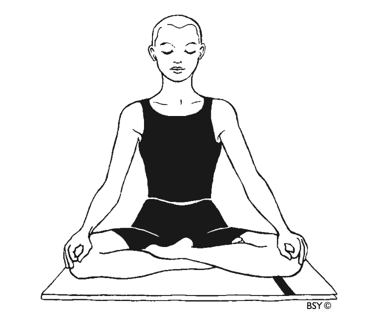

### ॥ १९ ॥ जानुर्वोरन्तरे सम्यक्कृत्वा पादतले उभे । ऋजुकायः समासीनः स्वस्तिकं तत्प्रचक्षते ॥

यह श्लोक **स्वस्तिकासन** की विधि और उसकी स्थिति का वर्णन करता है:

| श्लोक का अंश               | हिंदी अर्थ                                                  |
|----------------------------|-------------------------------------------------------------|
| **जानुर्वोरन्तरे सम्यक्-** | घुटनों (**जानु**) और जंघाओं (**उरु**) के बीच में भली-भाँति। |
| **कृत्वा पादतले उभे**      | दोनों पैरों के तलवों (**पादतले**) को स्थिर करके।            |
| **ऋजुकायः समासीनः**        | शरीर (रीढ़ की हड्डी) को **सीधा (ऋजु)** रखकर बैठना।          |
| **स्वस्तिकं तत्प्रचक्षते** | इसे ही **स्वस्तिकासन** कहा जाता है।                         |

> ध्यान के अभ्यास के लिए इस आसन का प्रयोग करें, क्योंकि यह रीढ़ को सीधा रखने और स्थिरता प्रदान करने में सरल व प्रभावी
> है।
> स्वस्तिकासन पैरों की नसों को संतुलित करता है और शरीर की मुद्रा को बिना किसी तनाव के सीधा रखता है, जो लंबे समय तक साधना
> के लिए आवश्यक है।

### 
गोमुखासन (गौ-मुख-आसन / cow’s face pose)

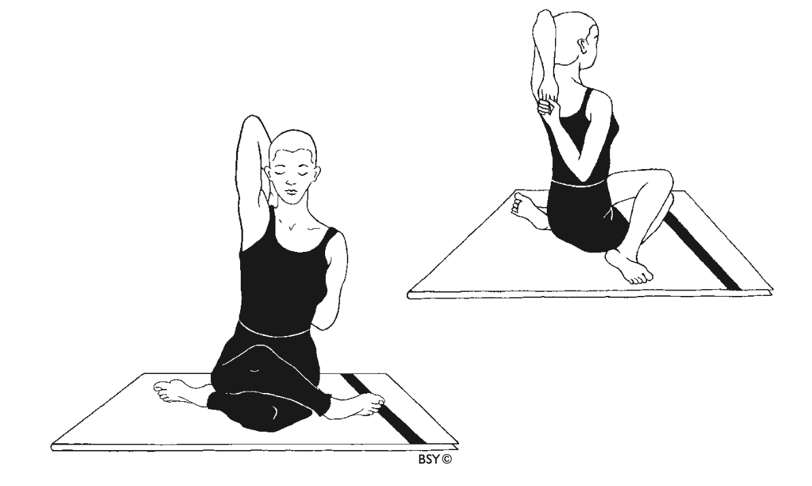

### ॥ २० ॥ सव्ये दक्षिणगुल्फं तु पृष्ठपार्श्वे नियोजयेत् । दक्षिणेऽपि तथा सव्यं गोमुखं गोमुखाकृतिः ॥

यह श्लोक **गोमुखासन** की विधि का वर्णन करता है:

| श्लोक का अंश                | हिंदी अर्थ                                                                       |
|-----------------------------|----------------------------------------------------------------------------------|
| **सव्ये दक्षिणगुल्फं तु**   | बाईं (**सव्य**) ओर दाहिने टखने (**दक्षिण गुल्फ**) को रखें।                       |
| **पृष्ठपार्श्वे नियोजयेत्** | नितम्ब के पास पीछे की ओर स्थिर करें।                                             |
| **दक्षिणेऽपि तथा सव्यं**    | इसी प्रकार दाहिनी ओर बाएं टखने को रखें।                                          |
| **गोमुखं गोमुखाकृतिः**      | यह आकृति **गाय के मुख** के समान दिखाई देती है, इसीलिए इसे **गोमुखासन** कहते हैं। |

> पैरों की मांसपेशियों में लचीलापन लाने और छाती को खोलने के लिए इस आसन का नियमित अभ्यास करें।
> इसकी विशिष्ट आकृति शरीर की ऊर्जा को संचित करने और साइटिका (Sciatica) जैसे विकारों को दूर करने में सहायक होती है।

### 
वीरासन (वीर मुद्रा / hero pose)

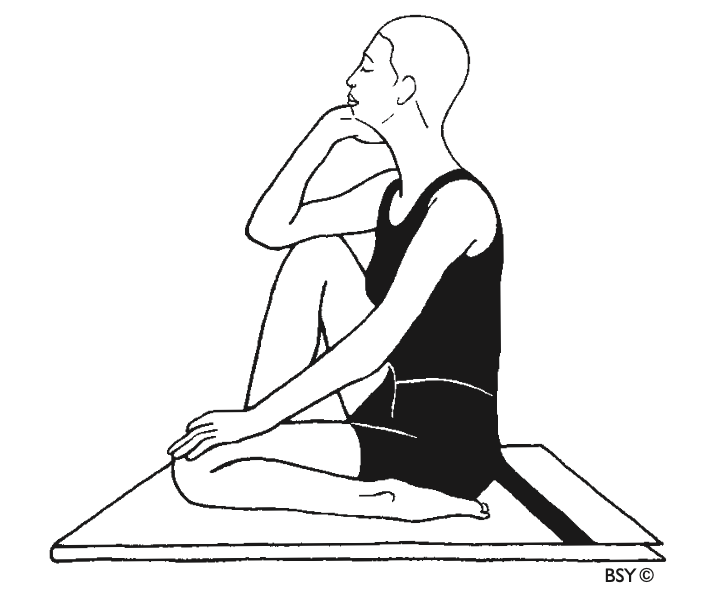
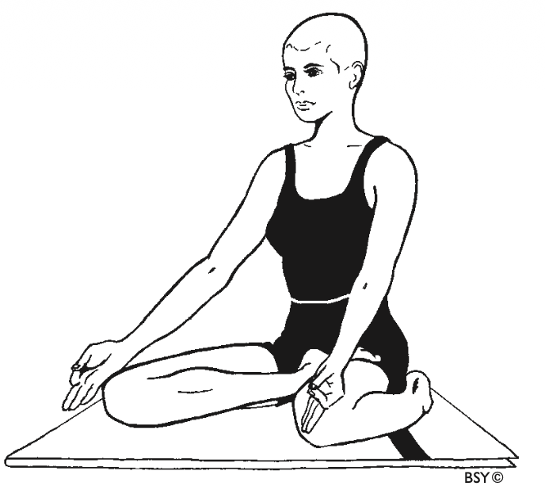

### ॥ २१ ॥ एकं पादं तथैकस्मिन्विन्यसेदुरुणि स्थिरतम् । इतरस्मिंस्तथा चोरुं वीरासनमितीरितम् ॥

यह श्लोक **वीरासन** की विधि का वर्णन करता है:

| श्लोक का अंश               | हिंदी अर्थ                                      |
|----------------------------|-------------------------------------------------|
| **एकं पादं तथैकस्मिन्**    | एक पैर को दूसरे पैर के ऊपर।                     |
| **विन्यसेदुरुणि स्थिरतम्** | दूसरी जंघा (**उरु**) पर स्थिरता के साथ रखें।    |
| **इतरस्मिंस्तथा चोरुं**    | इसी प्रकार दूसरे पैर को भी विपरीत जंघा पर रखें। |
| **वीरासनमितीरितम्**        | इसे ही **वीरासन** कहा गया है।                   |

> एकाग्रता और आत्मबल बढ़ाने के लिए इस आसन का अभ्यास करें, जो मानसिक दृढ़ता प्रदान करता है।
> वीरासन पैरों की मांसपेशियों को शक्तिशाली बनाता है और साधक के भीतर 'वीर' (साहस) के गुणों का संचार करता है, जो लंबी
> साधना के लिए आवश्यक है।

### 
कूर्मासन (कछुआ मुद्रा / tortoise pose)

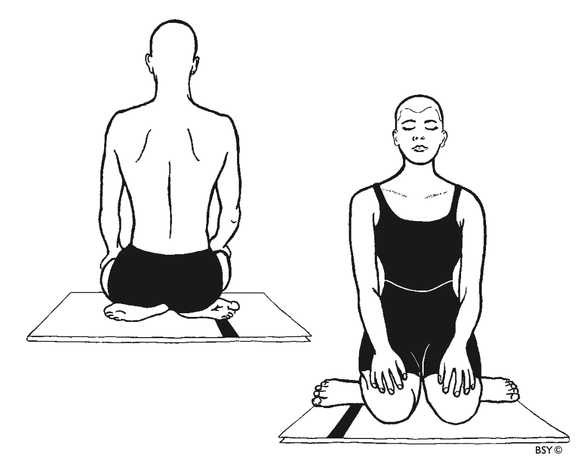
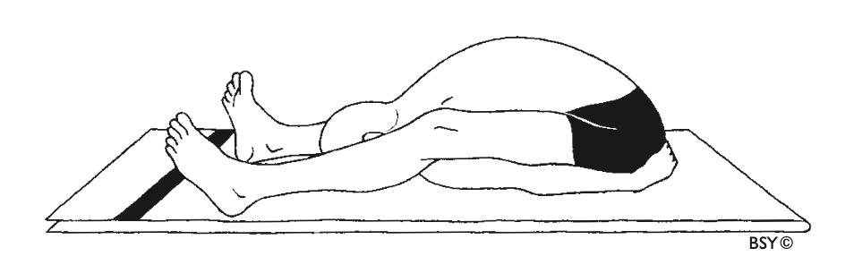

### ॥ २२ ॥ गुदं निरुध्य गुत्फाभ्यां व्युत्क्रमेण समाहितः । कूर्मासनं भवेदेतदिति योगविदो विदुः ॥

यह श्लोक **कूर्मासन** (कछुआ मुद्रा) की विधि को स्पष्ट करता है:

| श्लोक का अंश                 | हिंदी अर्थ                                                      |
|------------------------------|-----------------------------------------------------------------|
| **गुदं निरुध्य गुल्फाभ्यां** | दोनों टखनों (**गुल्फ**) से गुदा द्वार को दबाकर।                 |
| **व्युत्क्रमेण समाहितः**     | पैरों को विपरीत दिशा में (क्रॉस करके) सावधानीपूर्वक स्थित करें। |
| **कूर्मासनं भवेदेतद-**       | यह स्थिति **कूर्मासन** कहलाती है।                               |
| **इति योगविदो विदुः**        | ऐसा योग के ज्ञाता (**योगविद**) जानते हैं।                       |

> कामवासना पर नियंत्रण और अपान वायु के ऊर्ध्वगमन (ऊपर की ओर प्रवाह) के लिए इस आसन का अभ्यास करें।
> जिस प्रकार कछुआ अपने अंगों को समेट लेता है, यह आसन साधक की इंद्रियों को अंतर्मुखी करने और मूलाधार चक्र को
> उत्तेजित करने में सहायक होता है।

### 
कुक्कुटासन (मुर्गा मुद्रा / rooster pose)

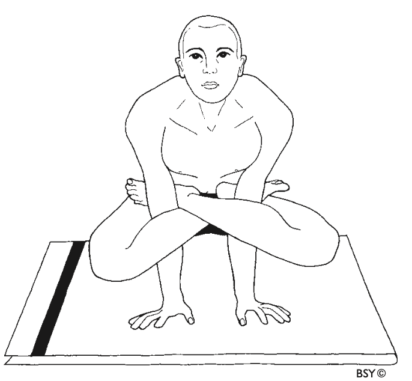

### ॥ २३ ॥ पद्मासनं तु संस्थाप्य जानुर्वोरन्तरे करौ । निवेश्य भूमौ संस्थाप्य व्योमस्थं कुक्कुटासनम् ॥

जैसा कि हमने पहले चर्चा की, यह श्लोक **कुक्कुटासन** की विधि बताता है। यहाँ इसका संक्षिप्त विवरण दिया गया है:

| श्लोक का अंश               | हिंदी अर्थ                                            |
|----------------------------|-------------------------------------------------------|
| **पद्मासनं तु संस्थाप्य**  | पहले **पद्मासन** लगाकर बैठें।                         |
| **जानुर्वोरन्तरे करौ**     | घुटनों और जंघाओं के बीच से दोनों हाथों को अंदर डालें। |
| **निवेश्य भूमौ संस्थाप्य** | हथेलियों को **भूमि** पर मजबूती से टिकाएं।             |
| **व्योमस्थं कुक्कुटासनम्** | शरीर को ऊपर उठाकर हवा (**व्योम**) में स्थिर करें।     |

> शारीरिक शक्ति और संतुलन के विकास के लिए इस आसन का अभ्यास करें।
> यह हाथों की मांसपेशियों को सुदृढ़ बनाता है और साधक के भीतर स्थिरता लाता है।

### 
उत्तानकूर्मासन (खिंचाव वाली कछुआ मुद्रा / stretching tortoise pose)

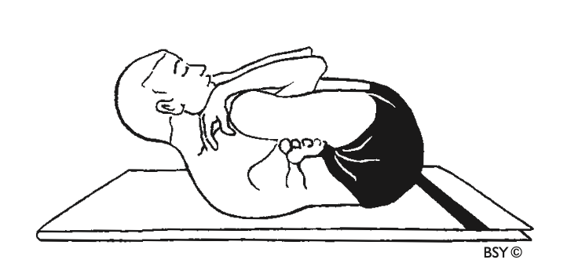
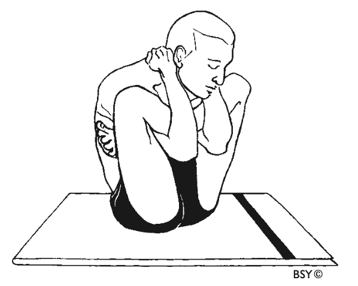

### ॥ २४ ॥ कुक्कुटासनबंधस्थो दोभ्यां संबध्य कंधराम् । भवेत्कूर्मवदुत्तान एतदुत्तानकूर्मकम् ॥

यह श्लोक **उत्तानकूर्मासन** (उल्टा कछुआ मुद्रा) की विधि का वर्णन करता है, जो कुक्कुटासन का ही एक विस्तार है:

| श्लोक का अंश               | हिंदी अर्थ                                                        |
|----------------------------|-------------------------------------------------------------------|
| **कुक्कुटासनबंधस्थो**      | कुक्कुटासन की स्थिति (हाथों को जंघाओं के बीच डालकर) में रहते हुए। |
| **दोभ्यां संबध्य कंधराम्** | दोनों हाथों से अपनी **गर्दन (कंधराम)** को पकड़ें।                  |
| **भवेत्कूर्मवदुत्तान**     | पीठ के बल चित्त होकर (उलटे कछुए के समान) लेट जाएँ।                |
| **एतदुत्तानकूर्मकम्**      | इसे ही **उत्तानकूर्मासन** कहा जाता है।                            |

> रीढ़ की हड्डी के लचीलेपन और शरीर के संतुलन को सुधारने के लिए इस आसन का अभ्यास करें।
> यह आसन गर्भस्थ शिशु की स्थिति के समान होता है, जो मांसपेशियों को गहरा खिंचाव देता है और मन को एकाग्र करने में
> अत्यंत प्रभावी है।

### 
धनुरासन (धनु मुद्रा / bow pose)

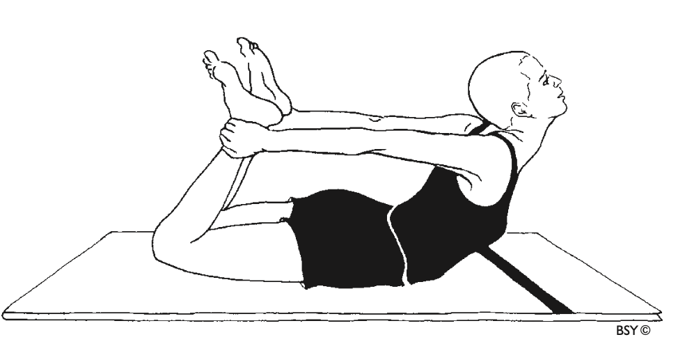
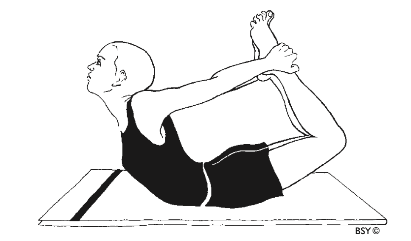
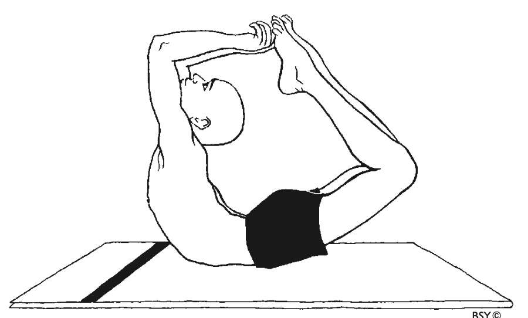

### ॥ २५ ॥ पादांगुष्ठौ तु पाणिभ्यां गृहीत्वा श्रवणावधि । धनुराकर्षणं कुर्याद्धनुरासनमुच्यते ॥

यह श्लोक **धनुरासन** की विधि का वर्णन करता है, जो शरीर को खींचे हुए धनुष के समान बना देता है:

| श्लोक का अंश                 | हिंदी अर्थ                                                 |
|------------------------------|------------------------------------------------------------|
| **पादांगुष्ठौ तु पाणिभ्यां** | दोनों हाथों (**पाणि**) से पैरों के दोनों अंगूठों को पकड़कर। |
| **गृहीत्वा श्रवणावधि**       | उन्हें खींचकर कानों (**श्रवण**) तक ले जाएँ।                |
| **धनुराकर्षणं कुर्याद्**     | इस प्रकार शरीर को खींचें जैसे कोई **धनुष** खींच रहा हो।    |
| **धनुरासनमुच्यते**           | इसे ही **धनुरासन** कहा जाता है।                            |

> रीढ़ की हड्डी के लचीलेपन और जठराग्नि (पाचन शक्ति) को तीव्र करने के लिए इस आसन का अभ्यास करें।
> यह आसन पेट की मांसपेशियों को सक्रिय करता है और कब्ज जैसी समस्याओं को दूर करने में सहायक है। *विशेष: हठयोग
प्रदीपिका की यह विधि आधुनिक धनुरासन (पीठ के बल लेटकर) से थोड़ी भिन्न और अधिक चुनौतीपूर्ण है।*

### 
मत्स्येन्द्रासन (रीढ़ की हड्डी को मोड़ने वाली मुद्रा / spinal twist pose)

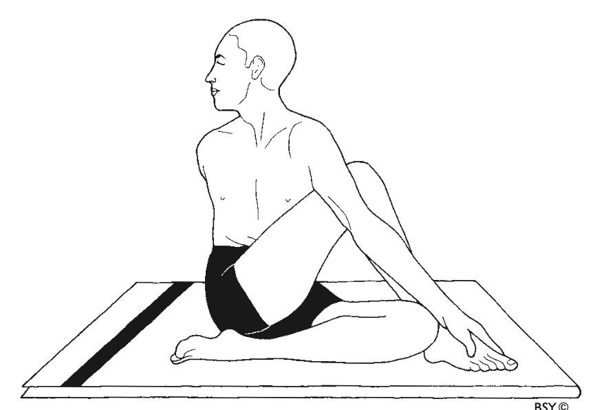
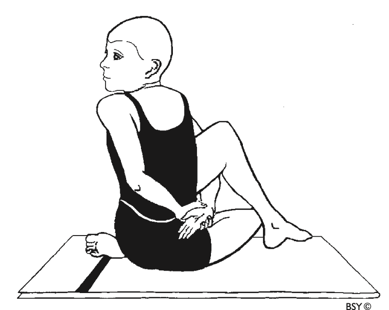
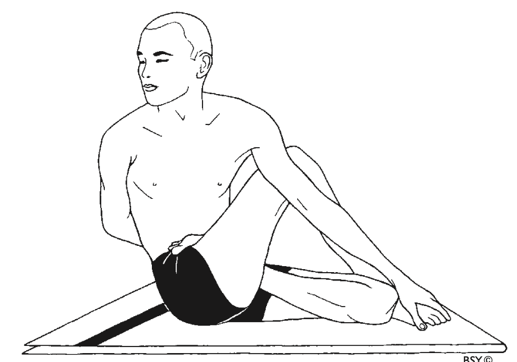

### ॥ २६ ॥ वामोरुमूलार्पितदक्षपादं जानोर्बहिर्वेष्टितवामपादम् । प्रगृह्य तिष्ठेत्परिवर्तितांगः श्रीमत्स्यनाथोदितमासनं स्यात् ॥

यह श्लोक **मत्स्येन्द्रासन** की विधि का वर्णन करता है, जिसे सिद्ध योगी मत्स्येन्द्रनाथ ने प्रतिपादित किया था:

| श्लोक का अंश                       | हिंदी अर्थ                                                             |
|------------------------------------|------------------------------------------------------------------------|
| **वामोरुमूलार्पितदक्षपादं**        | दाहिने पैर (**दक्षपाद**) को बाईं जंघा (**वाम उरु**) की जड़ में रखें।   |
| **जानोर्बहिर्वेष्टितवामपादम्**     | बाएं पैर को दाहिने घुटने (**जानु**) के बाहर की ओर लपेटकर रखें।         |
| **प्रगृह्य तिष्ठेत्परिवर्तितांगः** | शरीर के अंगों को **मोड़कर (ट्विस्ट)** और पैरों को पकड़कर स्थिर बैठें।  |
| **श्रीमत्स्यनाथोदितमासनं स्यात्**  | यह आसन **श्री मत्स्येन्द्रनाथ** द्वारा बताया गया (मत्स्येन्द्रासन) है। |

> रीढ़ की हड्डी के स्वास्थ्य और मधुमेह (Diabetes) जैसी समस्याओं के प्रबंधन के लिए इस आसन को सर्वोत्तम मानें।
> यह रीढ़ को एक गहरा मोड़ (Twist) देता है, जिससे नाड़ियाँ शुद्ध होती हैं और आंतरिक अंगों की मालिश होती है। यह
> कुण्डलिनी शक्ति को जागृत करने में भी सहायक माना जाता है।

### ॥ २७ ॥ मत्स्येन्द्रपीठं जठरप्रदीप्तिं प्रचंडरुग्मंडलखंडनास्त्रम् । अभ्यासतः कुंडलिनीप्रबोधं चन्द्रस्थिरत्वं च ददाति पुंसाम् ॥

यह श्लोक **मत्स्येन्द्रासन** के चमत्कारी लाभों का वर्णन करता है:

| श्लोक का अंश                        | हिंदी अर्थ                                                                       |
|-------------------------------------|----------------------------------------------------------------------------------|
| **मत्स्येन्द्रपीठं जठरप्रदीप्तिं**  | यह मत्स्येन्द्र-आसन **जठराग्नि** (पाचन शक्ति) को अत्यंत तीव्र करता है।           |
| **प्रचंडरुग्मंडलखंडनास्त्रम्**      | यह भयंकर रोगों (**रुग्मंडल**) के समूह को नष्ट करने के लिए **अस्त्र** के समान है। |
| **अभ्यासतः कुंडलिनीप्रबोधं**        | इसके निरंतर अभ्यास से **कुण्डलिनी शक्ति** जागृत होती है।                         |
| **चन्द्रस्थिरत्वं च ददाति पुंसाम्** | यह साधक के शरीर में **चंद्रमा** (बिंदु/अमृत) को स्थिरता प्रदान करता है।          |

> शारीरिक व्याधियों को दूर करने और आध्यात्मिक ऊर्जा के उत्थान के लिए इस आसन को अपनी साधना का मुख्य हिस्सा
> बनाएं।
> हठयोग में इसे इतना महत्वपूर्ण माना गया है कि इसे न केवल रोगों का नाशक (अस्त्र) कहा गया है, बल्कि इसे कुण्डलिनी
> जागरण और शरीर में 'अमृत' के क्षय को रोकने वाला भी बताया गया है।

### 
पश्चिमोत्तानासन (पीठ के खिंचाव वाली मुद्रा / back stretching pose)

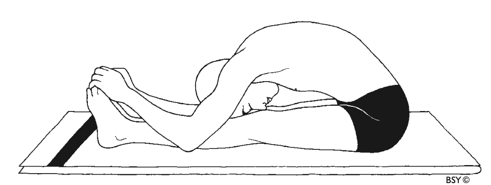

### ॥ २८ ॥ प्रसार्य पादौ भुवि दंडरूपौ दोभ्यां पदाग्रद्वितयं गृहीत्वा । जानूपरिन्यस्तललाटदेशो वसेदिदं पश्चिमतानमाहुः ॥

यह श्लोक **पश्चिमत्तानासन** की विधि का वर्णन करता है, जो हठयोग के सबसे महत्वपूर्ण आसनों में से एक है:

| श्लोक का अंश                       | हिंदी अर्थ                                                  |
|------------------------------------|-------------------------------------------------------------|
| **प्रसार्य पादौ भुवि दंडरूपौ**     | दोनों पैरों को जमीन (**भुवि**) पर डंडे के समान सीधा फैलाकर। |
| **दोभ्यां पदाग्रद्वितयं गृहीत्वा** | दोनों हाथों से पैरों के दोनों पंजों/अंगूठों को पकड़कर।       |
| **जानूपरिन्यस्तललाटदेशो**          | अपने माथे (**ललाट**) को घुटनों (**जानु**) पर टिकाकर।        |
| **वसेदिदं पश्चिमतानमाहुः**         | इस स्थिति में रुकें; इसे ही **पश्चिमत्तान** आसन कहते हैं।   |

> प्राण शक्ति को सुषुम्ना नाड़ी में प्रवाहित करने और शरीर के पिछले हिस्से (पश्चिम भाग) के लचीलेपन के लिए इसका
> अभ्यास अनिवार्य रूप से करें।
> यह आसन रीढ़ की हड्डी को पूरी तरह खींच देता है, जिससे पीठ की मांसपेशियों का तनाव कम होता है और प्राण ऊर्जा का
> संचार सुगम होता है।

### ॥ २९ ॥ इति पश्चिमतानमासनग्र्यं पवनं पश्चिमवाहिनं करोति । उदयं जठरानलस्य कुर्यादुदरे कार्श्यमरोगतां च पुंसाम् ॥

यह श्लोक **पश्चिमत्तानासन** के विशिष्ट लाभों का वर्णन करता है:

| श्लोक का अंश                | हिंदी अर्थ                                                                       |
|-----------------------------|----------------------------------------------------------------------------------|
| **इति पश्चिमतानमासनग्र्यं** | यह पश्चिमत्तानासन सभी आसनों में **श्रेष्ठ (अग्रणी)** है।                         |
| **पवनं पश्चिमवाहिनं करोति** | यह **प्राण (पवन)** को पीछे के मार्ग (**सुषुम्ना नाड़ी**) में प्रवाहित करता है।   |
| **उदयं जठरानलस्य कुर्याद्** | यह **जठराग्नि** (पाचन की अग्नि) को प्रचंड रूप से प्रदीप्त करता है।               |
| **उदरे कार्श्यमरोगतां च**   | यह पेट के मोटापे को कम कर उसे **दुबला (कार्श्य)** और शरीर को **निरोग** बनाता है। |

> यदि आप आध्यात्मिक उन्नति (प्राण का सुषुम्ना में प्रवेश) और पेट की समस्याओं से मुक्ति चाहते हैं, तो इस आसन
> का नियमित अभ्यास करें।
> हठयोग में इसे श्रेष्ठ माना गया है क्योंकि यह केवल शारीरिक स्वास्थ्य ही नहीं देता, बल्कि प्राणिक ऊर्जा को भौतिक
> शरीर से ऊपर उठाकर आध्यात्मिक मार्ग पर प्रशस्त करता है।

### 
मयूरासन (मोर मुद्रा / peacock pose)

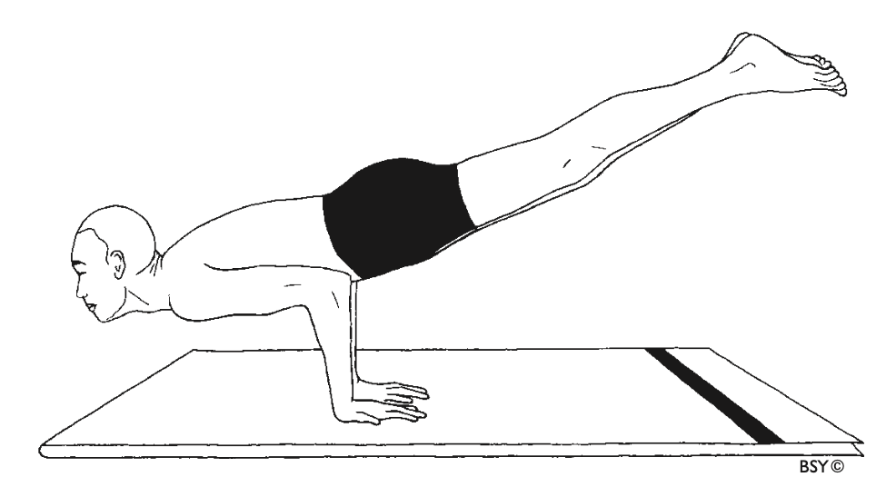
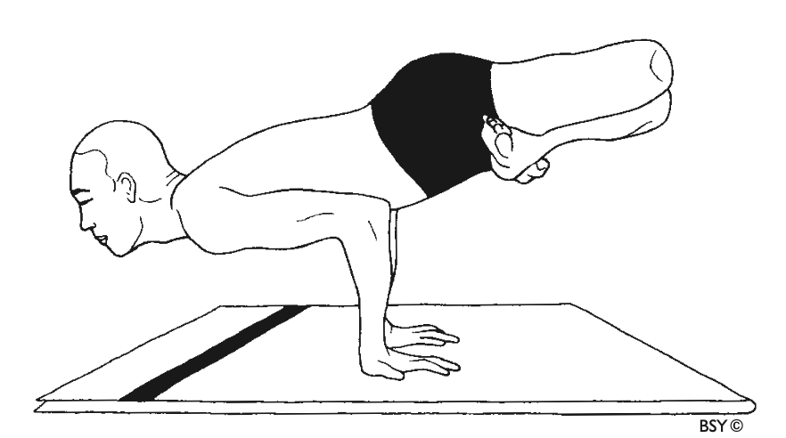

### ॥ ३० ॥ धरामवष्टभ्य करद्वयेन तत्कूर्परस्थापितनाभिपार्श्वः । उच्चासनो दंडवदुत्थितः खे मायूरमेतत्प्रवदन्ति पीठम् ॥

यह श्लोक **मयूरासन** की विधि का वर्णन करता है, जो शरीर को एक मोर की आकृति में संतुलित करता है:

| श्लोक का अंश                     | हिंदी अर्थ                                                          |
|----------------------------------|---------------------------------------------------------------------|
| **धरामवष्टभ्य करद्वयेन**         | दोनों हाथों (**करद्वय**) की हथेलियों को जमीन (**धरा**) पर टिकाकर।   |
| **तत्कूर्परस्थापितनाभिपार्श्वः** | दोनों कोहनियों (**कूर्पर**) को नाभि के दोनों किनारों पर स्थिर करके। |
| **उच्चासनो दंडवदुत्थितः खे**     | शरीर को एक डंडे के समान सीधा रखते हुए हवा (**खे**) में ऊपर उठाना।   |
| **मायूरमेतत्प्रवदन्ति पीठम्**    | इसे ही **मयूरासन** (मोर मुद्रा) कहा जाता है।                        |

> शारीरिक संतुलन विकसित करने और शरीर के भीतर के विषैले तत्वों को नष्ट करने के लिए इस आसन का अभ्यास करें।
> यह आसन पूरे शरीर का भार नाभि केंद्र और हाथों पर केंद्रित कर देता है, जिससे पाचन तंत्र को अत्यधिक बल मिलता है
> और रक्त संचार में सुधार होता है।

### ॥ ३१ ॥ हरति सकलरोगानाशु गुल्मोदरादी- नभिभवति च दोषानासनं श्रीमयरम् । बहु कदशनभुक्तं भस्म कुर्यादशेषं जनयति जठराग्निं जारयेत्कालकूटम् ॥

यह श्लोक **मयूरासन** के अत्यंत शक्तिशाली और प्रभावशाली लाभों का वर्णन करता है:

| श्लोक का अंश         | हिंदी अर्थ                                                                |
|----------------------|---------------------------------------------------------------------------|
| **हरति सकलरोगानाशु** | यह शीघ्र ही समस्त रोगों का नाश करता है।                                   |
| **गुल्मोदरादीन्**    | विशेषकर पेट की गाँठ (गुल्म), तिल्ली (spleen) और उदर रोगों को ठीक करता है। |
| **अभिभवति च दोषान-** | यह शरीर के तीनों दोषों (वात, पित्त, कफ) के असंतुलन को जीत लेता है।        |
| **बहु कदशनभुक्तं**   | अत्यधिक मात्रा में खाए गए **कुभोजन (खराब भोजन)** को भी।                   |
| **भस्म कुर्यादशेषं** | पूरी तरह से जलाकर **भस्म** कर देता है।                                    |
| **जनयति जठराग्निं**  | यह जठराग्नि को प्रचंड रूप से प्रदीप्त करता है।                            |
| **जारयेत्कालकूटम्**  | यहाँ तक कि यह **कालकूट (विष)** को भी पचाने की शक्ति देता है।              |

> यदि आपका पाचन तंत्र कमजोर है या आप शरीर को भीतर से शुद्ध (Detox) करना चाहते हैं, तो मयूरासन का अभ्यास करें।
> हठयोग में मयूरासन को विषनाशक माना गया है। जैसे मोर सांप को खाकर उसे पचा लेता है, वैसे ही यह आसन शरीर में जमा
> विषाक्त पदार्थों और गरिष्ठ भोजन को पचाने की क्षमता प्रदान करता है।

### 
शवासन (शव मुद्रा / corpse pose)

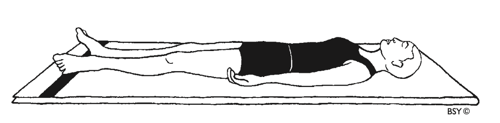

### ॥ ३२ ॥ उत्तानं शववद्भूमौ शयनं तच्छवासनम् । शवासनं श्रान्तिहरं चित्तविश्रान्तिकारकम् ॥

यह श्लोक **शवासन** की विधि और इसके मानसिक व शारीरिक लाभों का वर्णन करता है:

| श्लोक का अंश              | हिंदी अर्थ                                                    |
|---------------------------|---------------------------------------------------------------|
| **उत्तानं शववद्भूमौ**     | भूमि पर **शव (लाश)** के समान पीठ के बल सीधा लेट जाना।         |
| **शयनं तच्छवासनम्**       | लेटने की इस मुद्रा को ही **शवासन** कहा जाता है।               |
| **शवासनं श्रान्तिहरं**    | यह आसन शरीर की समस्त **थकान (श्रान्ति)** को दूर करने वाला है। |
| **चित्तविश्रान्तिकारकम्** | यह मन (**चित्त**) को शांति और विश्राम प्रदान करने वाला है।    |

> कठिन आसनों के अभ्यास के अंत में शरीर को पुनर्जीवित करने और मानसिक तनाव को शून्य करने के लिए इसका अभ्यास
> अवश्य करें।
> शवासन केवल लेटना नहीं है, बल्कि यह शरीर के प्रति सजगता और गहरे विश्राम की अवस्था है जो तंत्रिका तंत्र (Nervous
> System) को शांत करती है।

## (6/8 group) चार मुख्य आसन (33-54 / 67 श्लोक)

### ॥ ३३ ॥ चतुरशीत्यासनानि शिवेन कथितानि च । तेभ्यश्चतुष्कमादाय सारभूतं ब्रवीम्यहम् ॥

यह श्लोक हठयोग के आसनों की संख्या और उनकी श्रेष्ठता के पदानुक्रम को स्पष्ट करता है:

| श्लोक का अंश            | हिंदी अर्थ                                                                       |
|-------------------------|----------------------------------------------------------------------------------|
| **चतुरशीत्यासनानि**     | कुल **चौरासी (84)** आसनों का वर्णन।                                              |
| **शिवेन कथितानि च**     | भगवान **शिव** (आदिनाथ) द्वारा किया गया है।                                       |
| **तेभ्यश्चतुष्कमादाय**  | उन सभी में से **चार (4)** प्रमुख आसनों को चुनकर।                                 |
| **सारभूतं ब्रवीम्यहम्** | जो सबसे अधिक **सारवान (महत्वपूर्ण)** हैं, मैं (स्वात्माराम) उनका वर्णन करता हूँ। |

> यद्यपि योग में 84 लाख योनियों के प्रतीक स्वरूप अनेक आसन हैं, लेकिन गृहस्थ और साधक दोनों के लिए इन 4 मुख्य
> आसनों पर महारत हासिल करना पर्याप्त है।
> भगवान शिव के अनुसार, ये चार आसन संपूर्ण योग विज्ञान का सार हैं और कुंडलिनी जागरण व समाधि की प्राप्ति के लिए
> सबसे छोटे और सीधे मार्ग हैं।

### ॥ ३४ ॥ सिद्धं पद्मं तथा सिंहं भद्रं वेति चतुष्टयम् । श्रेष्ठं तत्रापि च सुखे तिष्ठेत्सिद्धासने सदा ॥

यह श्लोक भगवान शिव द्वारा बताए गए 84 आसनों में से सबसे महत्वपूर्ण 4 आसनों का नामकरण करता है और उनमें से सर्वश्रेष्ठ की
घोषणा करता है:

| श्लोक का अंश                   | हिंदी अर्थ                                            |
|--------------------------------|-------------------------------------------------------|
| **सिद्धं पद्मं तथा सिंहं**     | **सिद्धासन**, **पद्मासन** और **सिंहासन**।             |
| **भद्रं वेति चतुष्टयम्**       | तथा **भद्रासन**—ये चार (चतुष्टय) मुख्य आसन हैं।       |
| **श्रेष्ठं तत्रापि च**         | उन चारों में भी जो सबसे अधिक **श्रेष्ठ** है।          |
| **सुखे तिष्ठेत्सिद्धासने सदा** | वह **सिद्धासन** है; इसमें सदैव सुखपूर्वक बैठना चाहिए। |

> यदि आपके पास समय का अभाव है, तो केवल इन चार आसनों का अभ्यास करें, जिनमें सिद्धासन को प्राथमिकता दें।
> ये चार आसन शरीर की ऊर्जा को बांधने और मन को स्थिर करने में सबसे अधिक सक्षम हैं। सिद्धासन को सर्वश्रेष्ठ इसलिए
> माना गया है क्योंकि यह 72,000 नाड़ियों की शुद्धि में सीधे तौर पर सहायक होता है।

### सिद्धासन (सिद्ध मुद्रा / adept’s pose)

### तत्र सिद्धासनम्
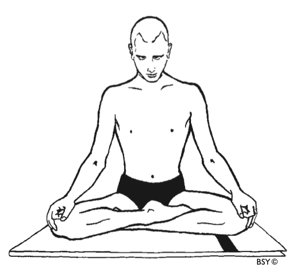
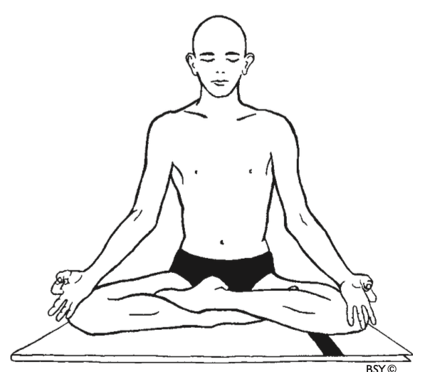
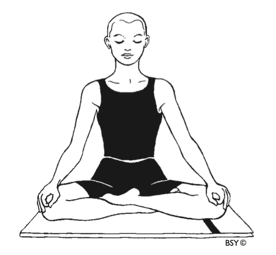
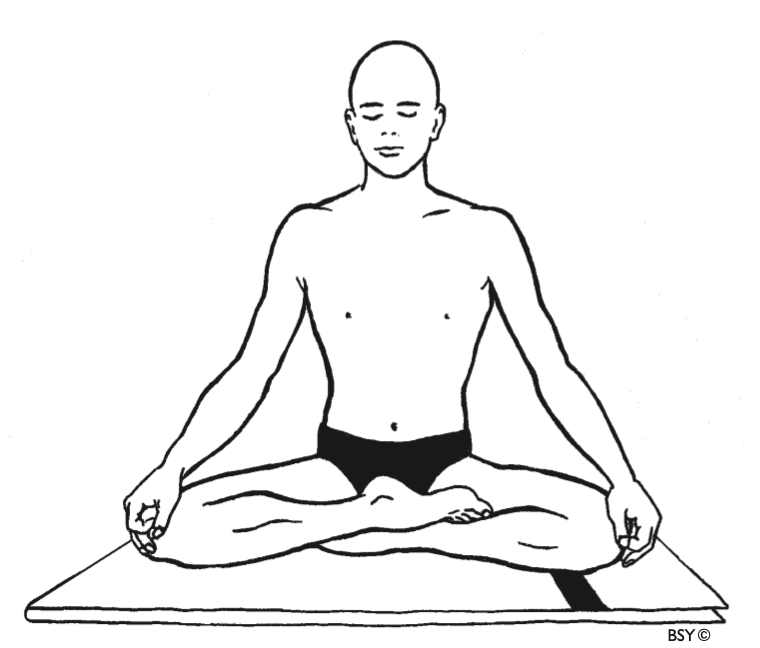
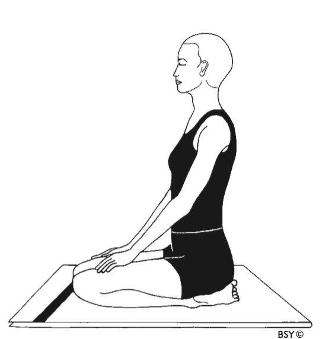
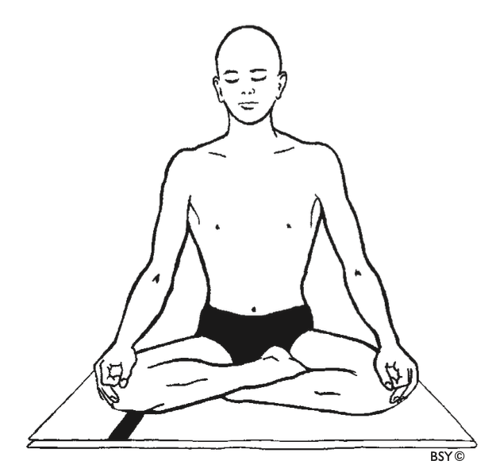
### ॥ ३५ ॥ योनिस्थानकमङ्रिघमूलघटितं कृत्वा दृढं विन्यसे- त्मेण्ढे पादमथैकमेव हृदये कृत्वा हनुं सुस्थिरम् । स्थाणुः संयमितेन्द्रियोऽचलदृशा पश्येद् भ्रुवोरन्तरं ह्येतन्मोक्षकपाटभेदनजनकं सिद्धासनं प्रोच्यते ॥ ३५ ॥

यह श्लोक हठयोग के सर्वश्रेष्ठ आसन, **सिद्धासन** की पूर्ण विधि और उसके आध्यात्मिक महत्व का वर्णन करता है:

| श्लोक का अंश                    | हिंदी अर्थ                                                            |
|---------------------------------|-----------------------------------------------------------------------|
| **योनिस्थानकमङ्रिघमूलघटितं**    | एक पैर की एड़ी को **योनि स्थान** (सीवन/Perineum) पर मजबूती से टिकाएं। |
| **मेण्ढे पादमथैकमेव**           | दूसरे पैर की एड़ी को **जनेंद्रिय (मेण्ढ)** के ऊपर स्थिर करें।         |
| **हृदये कृत्वा हनुं सुस्थिरम्** | ठुड्डी (**हनु**) को छाती (**हृदय**) से लगाकर जालंधर बंध लगायें।       |
| **स्थाणुः संयमितेन्द्रियो**     | इंद्रियों को वश में कर, स्थाणु (खंभे) के समान स्थिर हो जाएं।          |
| **पश्येद् भ्रुवोरन्तरं**        | अपनी दृष्टि को दोनों भौंहों के बीच (**भ्रूमध्य**) एकाग्र करें।        |
| **मोक्षकपाटभेदनजनकं**           | यह **मोक्ष के द्वार** (कपाट) को खोलने वाला है।                        |

> मोक्ष और आध्यात्मिक सिद्धि की इच्छा रखने वाले साधकों को इस आसन का अभ्यास प्रतिदिन करना चाहिए।
> सिद्धासन न केवल शरीर को स्थिरता देता है, बल्कि यह प्राण शक्ति को सीधे ऊपर की ओर प्रवाहित कर ब्रह्मरंध्र के
> मार्ग को खोलता है, जिसे 'मोक्ष-कपाट भेदन' कहा गया है।

### ॥ ३६ ॥ मेण्ढ्रादुपरि विन्यस्य सव्यं गुल्फं तथोपरि । गुल्फान्तरं च निक्षिप्य सिद्धासनमिदं भवेत् ॥

यह श्लोक **सिद्धासन** की एक सरल वैकल्पिक विधि का वर्णन करता है, जिसे अक्सर अभ्यास की सुगमता के लिए अपनाया जाता है:

| श्लोक का अंश                | हिंदी अर्थ                                                                   |
|-----------------------------|------------------------------------------------------------------------------|
| **मेण्ढ्रादुपरि विन्यस्य**  | एक टखने (**गुल्फ**) को जनेंद्रिय (**मेण्ढ**) के ऊपर रखें।                    |
| **सव्यं गुल्फं तथोपरि**     | फिर दूसरे (बाएं) टखने को उसके ठीक ऊपर रखें।                                  |
| **गुल्फान्तरं च निक्षिप्य** | दोनों टखनों को एक-दूसरे के ऊपर इस प्रकार व्यवस्थित करें कि वे स्थिर हो जाएं। |
| **सिद्धासनमिदं भवेत्**      | इसे भी **सिद्धासन** ही कहा जाता है।                                          |

> यदि श्लोक ३५ में वर्णित विधि (योनि स्थान पर दबाव) कठिन लगे, तो इस सरल विधि का उपयोग करें।
> यह विधि टखनों के मिलन बिंदु पर ऊर्जा के केंद्र को सक्रिय करती है और ध्यान के लिए एक मजबूत आधार प्रदान करती है।

### ॥ ३७ ॥ एतत्सिद्धासनं प्राहुरन्ये वज्रासनं विदुः । मुक्तासनं वदन्त्येके प्राहुर्गुप्तासनं परे ॥

यह श्लोक **सिद्धासन** की सर्वव्यापकता और विभिन्न योग परंपराओं में इसके अलग-अलग नामों का वर्णन करता है:

| श्लोक का अंश               | हिंदी अर्थ                                                    |
|----------------------------|---------------------------------------------------------------|
| **एतत्सिद्धासनं प्राहुर-** | इसे अधिकांश आचार्य **सिद्धासन** कहते हैं।                     |
| **अन्ये वज्रासनं विदुः**   | अन्य कुछ परंपराओं में इसे **वज्रासन** के नाम से जाना जाता है। |
| **मुक्तासनं वदन्त्येके**   | कुछ योगी इसे **मुक्तासन** कहते हैं।                           |
| **प्राहुर्गुप्तासनं परे**  | तथा अन्य विद्वान इसे **गुप्तासन** के नाम से पुकारते हैं।      |

> नामों के भेद में न उलझकर इस मुद्रा की स्थिरता पर ध्यान दें, क्योंकि यह सभी नामों के गुणों को समाहित करती
> है।
> अलग-अलग योगियों ने इस आसन के विशेष प्रभाव (जैसे नाड़ियों को वज्र जैसा बनाना या इंद्रियों को गुप्त करना) के
> आधार पर इसके भिन्न नाम रखे हैं, परंतु मूल विधि और उद्देश्य समान है।

### ॥ ३८ ॥ यमेष्विव मिताहारमहिंसां नियमेष्विव । मुख्यं सर्वासनेष्वेकं सिद्धासनं विदुः ॥

यह श्लोक योग के अनुशासन में **सिद्धासन** की सर्वोच्चता की तुलना 'यम' और 'नियम' के सबसे महत्वपूर्ण अंगों से करता है:

| श्लोक का अंश              | हिंदी अर्थ                                                    |
|---------------------------|---------------------------------------------------------------|
| **यमेष्विव मिताहारम्**    | जैसे सभी 'यमों' में **मिताहार** (संतुलित भोजन) सबसे मुख्य है। |
| **अहिंसां नियमेष्विव**    | जैसे सभी 'नियमों' में **अहिंसा** सर्वोपरि है।                 |
| **मुख्यं सर्वासनेष्वेकं** | वैसे ही सभी आसनों में एकमात्र **सिद्धासन** ही मुख्य है।       |
| **सिद्धासनं विदुः**       | ऐसा योग के विद्वान जानते और मानते हैं।                        |

> यदि आप योग के सूक्ष्म अंगों (प्राणायाम और समाधि) में प्रवेश करना चाहते हैं, तो सिद्धासन को अपना आधार बनाएँ।
> जिस प्रकार मिताहार के बिना यम और अहिंसा के बिना नियम अधूरे हैं, उसी प्रकार सिद्धासन की सिद्धि के बिना अन्य
> आसनों का फल पूर्णतः प्राप्त नहीं होता। यह आसन सीधे तौर पर नाड़ी शुद्धि का मार्ग प्रशस्त करता है।

### ॥ ३९ ॥ चतुरशीतिपीठेषु सिद्धमेव सदाभ्यसेत् । द्वासप्ततिसहस्राणां नाडीनां मलशोधनम् ॥

यह श्लोक **सिद्धासन** के अभ्यास की अनिवार्यता और इसके गहरे प्रभाव को स्पष्ट करता है:

| श्लोक का अंश            | हिंदी अर्थ                                        |
|-------------------------|---------------------------------------------------|
| **चतुरशीतिपीठेषु**      | चौरासी (84) आसनों में से।                         |
| **सिद्धमेव सदाभ्यसेत्** | सदैव **सिद्धासन** का ही निरंतर अभ्यास करना चाहिए। |
| **द्वासप्ततिसहस्राणां** | यह शरीर की **बहत्तर हजार (72,000)**।              |
| **नाडीनां मलशोधनम्**    | नाड़ियों के मल (अशुद्धियों) का शोधन करता है।      |

> शरीर के ऊर्जा मार्ग को पूरी तरह शुद्ध करने के लिए सिद्धासन को अपनी दैनिक साधना का केंद्र बनाएँ।
> ७२,००० नाड़ियाँ हमारे सूक्ष्म शरीर का आधार हैं; जब तक ये शुद्ध नहीं होतीं, प्राण का प्रवाह बाधित रहता है।
> सिद्धासन इन सभी नाड़ियों को एक साथ प्रभावित करने की क्षमता रखता है।

### ॥ ४० ॥ आत्मध्यायी मिताहारी यावद्द्वादशवत्सरम् । सदा सिद्धासनाभ्यासाद्योगी निष्पत्तिमप्नुयात् ॥

यह श्लोक **सिद्धासन** की सिद्धि की अवधि और उससे प्राप्त होने वाली सर्वोच्च अवस्था 'निष्पत्ति' का वर्णन करता है:

| श्लोक का अंश                | हिंदी अर्थ                                                                  |
|-----------------------------|-----------------------------------------------------------------------------|
| **आत्मध्यायी मिताहारी**     | आत्मा का ध्यान करने वाला और **मिताहारी** (संयमित भोजन करने वाला) साधक।      |
| **यावद्द्वादशवत्सरम्**      | यदि निरंतर **बारह वर्षों (12 years)** तक।                                   |
| **सदा सिद्धासनाभ्यासाद्**   | सदैव सिद्धासन का अभ्यास करता है।                                            |
| **योगी निष्पत्तिमप्नुयात्** | तो वह योगी **निष्पत्ति** (योग की अंतिम/पूर्ण अवस्था) को प्राप्त कर लेता है। |

> दीर्घकालिक आध्यात्मिक लक्ष्यों के लिए धैर्यपूर्वक संयमित जीवनशैली के साथ इस आसन को साधें।
> बारह वर्ष की अवधि शरीर और मन के पूर्ण रूपांतरण के लिए आवश्यक मानी गई है। मिताहार और आत्म-चिन्तन के साथ किया
> गया सिद्धासन का अभ्यास साधक को समाधि की उच्चतम अवस्था तक ले जाता है।

### ॥ ४१ ॥ किमन्यैर्बहुभिः पीठैः सिद्धे सिद्धासने सति । प्राणानिले सावधाने बद्धे केवलकुंभके । उत्पद्यते निरायासात्स्वयमेवोन्मनी कला ॥

यह श्लोक **सिद्धासन** की पराकाष्ठा और उससे प्राप्त होने वाली मानसिक अवस्था 'उन्मनी' का वर्णन करता है:

| श्लोक का अंश              | हिंदी अर्थ                                                          |
|---------------------------|---------------------------------------------------------------------|
| **किमन्यैर्बहुभिः पीठैः** | जब सिद्धासन सिद्ध हो जाए, तो अन्य बहुत से आसनों की क्या आवश्यकता?   |
| **सिद्धे सिद्धासने सति**  | सिद्धासन में कुशलता प्राप्त कर लेने पर।                             |
| **प्राणानिले सावधाने**    | जब प्राण वायु (प्राणानिल) सावधानीपूर्वक स्थिर हो जाती है।           |
| **बद्धे केवलकुंभके**      | और **केवल कुम्भक** (बिना प्रयास के सांस का रुकना) स्वतः लग जाता है। |
| **उत्पद्यते निरायासात्**  | तब बिना किसी प्रयास के सहज ही।                                      |
| **स्वयमेवोन्मनी कला**     | **उन्मनी अवस्था** (विचारशून्य उच्च चेतना) प्रकट हो जाती है।         |

> केवल शारीरिक व्यायाम के बजाय मानसिक शांति और विचारशून्यता (उन्मनी) प्राप्त करने के लिए सिद्धासन को प्रधानता
> दें।
> सिद्धासन का अभ्यास जब परिपक्व होता है, तो सांस अपने आप स्थिर होने लगती है जिसे 'केवल कुम्भक' कहते हैं। इसके
> सिद्ध होते ही मन शांत होकर समाधि की 'उन्मनी' अवस्था में प्रवेश कर जाता है, जहाँ साधक और ईश्वर का मिलन संभव है।

### ॥ ४२ ॥ तथैकस्मिन्नेव दृढे सिद्धे सिद्धासने सति । बंधत्रयमनायासात्स्वयमेवोपजायते ॥

यह श्लोक **सिद्धासन** की उस शक्ति का वर्णन करता है जिससे योग के तीन प्रमुख 'बंध' स्वतः ही सिद्ध हो जाते हैं:

| श्लोक का अंश             | हिंदी अर्थ                                                               |
|--------------------------|--------------------------------------------------------------------------|
| **तथैकस्मिन्नेव दृढे**   | इसी प्रकार, केवल एक ही आसन के दृढ़ हो जाने पर।                           |
| **सिद्धे सिद्धासने सति** | जब **सिद्धासन** पूरी तरह सिद्ध हो जाता है।                               |
| **बंधत्रयमनायासात्**     | तब तीनों बंध (**जालंधर, उड्डियान और मूल**) बिना किसी अतिरिक्त प्रयास के। |
| **स्वयमेवोपजायते**       | अपने आप ही (सहज रूप से) लग जाते हैं।                                     |

> यदि आप बंधों के अभ्यास में कठिनाई महसूस करते हैं, तो सिद्धासन को स्थिर करें; इससे आंतरिक ऊर्जा का नियंत्रण
> सुलभ हो जाएगा।
> सिद्धासन की शारीरिक संरचना ऐसी है कि एड़ी का दबाव योनि स्थान पर होने से **मूल बंध**, रीढ़ की सीधी स्थिति से *
*उड्डियान बंध** और ठुड्डी के झुकाव से **जालंधर बंध** की स्थिति प्राकृतिक रूप से बनने लगती है।

### ॥ ४३ ॥ नासनं सिद्धसदृशं न कुंभः केवलोपमः । न खेचरीसमा मुद्रा न नादसदृशो लयः ॥

यह श्लोक हठयोग के चार सबसे महत्वपूर्ण अंगों की तुलना करते हुए उनकी अद्वितीयता को स्थापित करता है:

| श्लोक का अंश          | हिंदी अर्थ                                                                   |
|-----------------------|------------------------------------------------------------------------------|
| **नासनं सिद्धसदृशं**  | **सिद्धासन** के समान दूसरा कोई श्रेष्ठ आसन नहीं है।                          |
| **न कुंभः केवलोपमः**  | **केवल कुम्भक** के समान दूसरा कोई प्राणायाम नहीं है।                         |
| **न खेचरीसमा मुद्रा** | **खेचरी मुद्रा** के समान दूसरी कोई मुद्रा नहीं है।                           |
| **न नादसदृशो लयः**    | और **नादानुसंधान** के समान चित्त विलीन (लय) करने का कोई दूसरा मार्ग नहीं है। |

> यदि आप योग के विशाल समुद्र में भ्रमित हैं, तो इन चार स्तंभों (सिद्धासन, केवल कुम्भक, खेचरी और नाद) को अपनी
> साधना का मुख्य आधार बनाएँ।
> स्वात्माराम जी स्पष्ट करते हैं कि ये चार तत्व योग के अलग-अलग अंगों (आसन, प्राणायाम, मुद्रा और समाधि) की
> पराकाष्ठा हैं। इनमें से प्रत्येक अपने क्षेत्र में पूर्णता प्रदान करने वाला है।

### पद्मासन (कमल मुद्रा / lotus pose)

### अथ पद्मासनम् ।
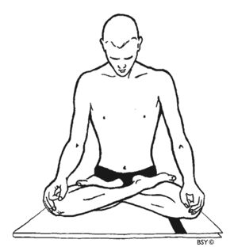
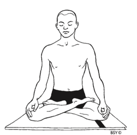
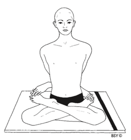

### ॥ ४४ ॥ वामोरुपरि दक्षिणं च चरणं संस्थाप्य वामं तथा दक्षोरुपरि पश्चिमेन विधिना धृत्वा कराभ्यां दृढम् । अंगुष्ठौ हृदये निधाय चिबुकं नासाग्रमालोकयेत् एतद्व्याधिविनाशकारि यमिनां पद्मासनं प्रोच्यते ॥

यह श्लोक **पद्मासन** (कमल मुद्रा) की प्रथम विधि का वर्णन करता है, जो शारीरिक रोगों के नाश के लिए प्रसिद्ध है:

| श्लोक का अंश                        | हिंदी अर्थ                                                     |
|-------------------------------------|----------------------------------------------------------------|
| **वामोरुपरि दक्षिणं च चरणं**        | बाएं पैर की जंघा (**वाम उरु**) पर दाहिना चरण रखें।             |
| **संस्थाप्य वामं तथा दक्षोरुपरि**   | और वैसे ही दाएं पैर की जंघा पर बाएं चरण को स्थापित करें।       |
| **पश्चिमेन विधिना धृत्वा कराभ्यां** | हाथों को पीछे से ले जाकर (**पश्चिमेन विधिना**) दोनों हाथों से। |
| **अंगुष्ठौ... दृढम्**               | पैरों के अंगूठों को मजबूती से पकड़ें।                           |
| **हृदये निधाय चिबुकं**              | ठुड्डी (**चिबुक**) को छाती (हृदय) से सटाकर लगाएँ (जालंधर बंध)। |
| **नासाग्रमालोकयेत्**                | अपनी दृष्टि को **नासिका के अग्र भाग** पर एकाग्र करें।          |
| **एतद्व्याधिविनाशकारि**             | यह आसन समस्त रोगों (**व्याधि**) का विनाश करने वाला है।         |
| **यमिनां पद्मासनं प्रोच्यते**       | योगियों द्वारा इसे ही **पद्मासन** कहा जाता है।                 |

> शारीरिक व्याधियों से मुक्ति और मानसिक एकाग्रता के लिए इस 'बद्ध-पद्मासन' स्वरूप का अभ्यास करें।
> यह विधि शरीर की ऊर्जा को पूरी तरह से बंद (Lock) कर देती है, जिससे प्राण का क्षय रुकता है और जठराग्नि प्रदीप्त
> होती है, जो रोगों को समूल नष्ट करने में सक्षम है।

### ॥ ४५ ॥ उत्तानौ चरणौ कृत्वा ऊरुसंस्थौ प्रयत्नतः । ऊरुमध्ये तथोत्तानौ पाणी कृत्वा ततो दृशौ ॥

यह श्लोक **पद्मासन** की दूसरी विधि का वर्णन करता है, जो ध्यान और स्थिरता के लिए अत्यंत प्रभावी मानी जाती है:

| श्लोक का अंश             | हिंदी अर्थ                                                |
|--------------------------|-----------------------------------------------------------|
| **उत्तानौ चरणौ कृत्वा**  | दोनों पैरों के तलवों को ऊपर की ओर (**उत्तान**) करके।      |
| **ऊरुसंस्थौ प्रयत्नतः**  | सावधानीपूर्वक दोनों जंघाओं (**ऊरु**) पर स्थापित करें।     |
| **ऊरुमध्ये तथोत्तानौ**   | दोनों जंघाओं के बीच (गोद में) वैसे ही ऊपर की ओर खुले हुए। |
| **पाणी कृत्वा ततो दृशौ** | दोनों हाथों को रखें और फिर अपनी दृष्टि को स्थिर करें।     |

> ध्यान और लंबे समय तक बैठने के अभ्यास के लिए इस विधि को प्राथमिकता दें।
> पिछले श्लोक की तुलना में यह मुद्रा अधिक आरामदायक है, जो शरीर के रक्त संचार को उदर क्षेत्र की ओर केंद्रित करती
> है और रीढ़ को प्राकृतिक रूप से सीधा रखती है।

### ॥ ४६ ॥ नासाग्रे विन्यसेद्राजदंतमूले तु जिह्वया । उत्तंभ्य चिबुकं वक्षस्युत्थाप्य पवनं शनैः ॥

यह श्लोक **पद्मासन** में बैठने के बाद की जाने वाली आंतरिक क्रियाओं (दृष्टि, जिह्वा और प्राण का संयोजन) का वर्णन करता है:

| श्लोक का अंश                 | हिंदी अर्थ                                                        |
|------------------------------|-------------------------------------------------------------------|
| **नासाग्रे विन्यसेद्**       | अपनी दृष्टि को **नासिका के अग्र भाग** (नाक की नोक) पर स्थिर करें। |
| **राजदंतमूले तु जिह्वया**    | जिह्वा (जीभ) को ऊपर के दांतों के मूल (**राजदंत**) भाग में लगाएँ।  |
| **उत्तंभ्य चिबुकं वक्षस्यु** | ठुड्डी (**चिबुक**) को छाती (**वक्ष**) से लगाकर जालंधर बंध बनाएँ।  |
| **त्थाप्य पवनं शनैः**        | इसके बाद प्राण वायु (पवन) को धीरे-धीरे ऊपर की ओर उठाएँ।           |

> पद्मासन लगाते समय केवल बैठने पर ही नहीं, बल्कि इन सूक्ष्म क्रियाओं (खेचरी का प्रारंभिक रूप और जालंधर बंध)
> पर भी ध्यान दें।
> दृष्टि को नासाग्र पर रखने से मन स्थिर होता है और जिह्वा को तालु/दांतों के मूल में लगाने से प्राण का
> उर्ध्वगमन (ऊपर की ओर जाना) सुलभ हो जाता है, जिससे ध्यान की गहराई बढ़ती है।

### ॥ ४७ ॥ इदं पद्मासनं प्रोक्तं सर्वव्याधिविनाशनम् । दुर्लभं येन केनापि धीमता लभ्यते भुवि ॥

यह श्लोक **पद्मासन** की महिमा और इसकी दुर्लभता का वर्णन करता है:

| श्लोक का अंश              | हिंदी अर्थ                                                                        |
|---------------------------|-----------------------------------------------------------------------------------|
| **इदं पद्मासनं प्रोक्तं** | इस मुद्रा को **पद्मासन** कहा गया है।                                              |
| **सर्वव्याधिविनाशनम्**    | यह सभी प्रकार के शारीरिक और मानसिक रोगों (**व्याधि**) को नष्ट करने वाला है।       |
| **दुर्लभं येन केनापि**    | यह आसन साधारण अभ्यासियों के लिए **दुर्लभ** (कठिन) है।                             |
| **धीमता लभ्यते भुवि**     | इस पृथ्वी पर केवल **बुद्धिमान (धैर्यवान)** साधक ही इसे पूर्णतः सिद्ध कर पाते हैं। |

> इसे केवल एक शारीरिक मुद्रा न मानकर पूर्ण श्रद्धा के साथ अभ्यास करें, क्योंकि इसकी पूर्ण सिद्धि असाधारण है।
> पद्मासन केवल पैरों को मोड़ना नहीं है, बल्कि प्राणों को संतुलित करने की एक जटिल प्रक्रिया है। इसे 'दुर्लभ' इसलिए
> कहा गया है क्योंकि इसमें शरीर की स्थिरता के साथ मन की एकाग्रता का मिलना अनिवार्य है।

### ॥ ४८ ॥ कृत्वासंपुटितौ करौ दृढतरं बद्ध्वातु पद्मासनं गाढं वक्षसि सन्निधाय चिबुकं ध्यायंश्र्च तच्चेतसि । वारंवारमपानमूर्ध्वमनिलं प्रोत्सारयन्पूरितं न्यंचन्प्राणमुपैति बोधमतुलं शक्तिप्रभावान्न्रः ॥

यह श्लोक **पद्मासन** के साथ की जाने वाली उस गुप्त प्राणिक क्रिया का वर्णन करता है जो कुण्डलिनी शक्ति को जाग्रत करती है:

| श्लोक का अंश                    | हिंदी अर्थ                                                              |
|---------------------------------|-------------------------------------------------------------------------|
| **कृत्वासंपुटितौ करौ**          | दोनों हथेलियों को गोद में एक-दूसरे के ऊपर रखकर।                         |
| **दृढतरं बद्ध्वातु पद्मासनं**   | मजबूती से पद्मासन लगाकर स्थिर हो जाएं।                                  |
| **गाढं वक्षसि सन्निधाय चिबुकं** | ठुड्डी (**चिबुक**) को छाती से सटाकर दृढ़ जालंधर बंध लगाएं।              |
| **ध्यायंश्र्च तच्चेतसि**        | उस परम तत्व (ब्रह्म) का मन में निरंतर ध्यान करें।                       |
| **वारंवारमपानमूर्ध्वमनिलं**     | बार-बार **अपान वायु** को ऊपर की ओर खींचें (मूल बंध द्वारा)।             |
| **न्यंचन्प्राणमुपैति**          | और पूरक द्वारा भरे हुए **प्राण** को नीचे की ओर दबाएं।                   |
| **बोधमतुलं शक्तिप्रभावान्न्रः** | इस शक्ति के प्रभाव से मनुष्य अनुपम **बोध** (आत्मज्ञान) प्राप्त करता है। |

> आध्यात्मिक जागरण के लिए पद्मासन में बैठकर 'प्राण' और 'अपान' को नाभि केंद्र पर मिलाने का अभ्यास करें।
> जब प्राण को नीचे दबाया जाता है और अपान को ऊपर उठाया जाता है, तो इनके घर्षण से उत्पन्न अग्नि कुण्डलिनी शक्ति को
> जाग्रत करती है, जिससे साधक को आत्म-साक्षात्कार या 'अतुल बोध' प्राप्त होता है।

### ॥ ४९ ॥ पद्मासने स्थितो योगी नाडीद्वारेण पूरितम् । मारुतं धारयेद्यस्तु स मुक्तोनात्र संशयः ॥

यह श्लोक **पद्मासन** में प्राणायाम की पूर्णता और उससे प्राप्त होने वाली मुक्ति का वर्णन करता है:

| श्लोक का अंश             | हिंदी अर्थ                                                       |
|--------------------------|------------------------------------------------------------------|
| **पद्मासने स्थितो योगी** | पद्मासन में स्थिर होकर बैठा हुआ योगी।                            |
| **नाडीद्वारेण पूरितम्**  | नासिका छिद्रों (नाड़ी के द्वार) से वायु को भीतर भरकर।            |
| **मारुतं धारयेद्यस्तु**  | जो उस प्राण वायु (**मारुत**) को भीतर रोकता (कुम्भक करता) है।     |
| **स मुक्तोनात्र संशयः**  | वह निश्चित रूप से **मुक्त** हो जाता है, इसमें कोई संदेह नहीं है। |

> केवल आसन तक न रुकें; पद्मासन में बैठकर कुम्भक (साँस रोकने) का अभ्यास करें ताकि प्राण स्थिर हो सके।
> पद्मासन नाड़ियों के द्वार को सुलभ बनाता है। जब इस अवस्था में प्राण को धारण किया जाता है, तो वह सुषुम्ना नाड़ी
> में प्रवेश करता है, जो आध्यात्मिक मुक्ति का एकमात्र मार्ग है।

### सिंहासन (सिंह मुद्रा / lion pose)

### अथ सिंहासनम् ।
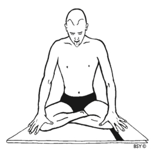
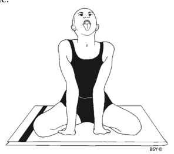

### ॥ ५० ॥ गुल्फौ च वृषणस्याधः सीवन्याः पार्श्वयोः क्षिपेत् । दक्षिणे सव्यगुल्फं तु दक्षगुल्फं तु सव्यके ॥

यह श्लोक **सिंहासन** की आधारभूत शारीरिक स्थिति (पैरों की बनावट) का वर्णन करता है:

| श्लोक का अंश                     | हिंदी अर्थ                                                             |
|----------------------------------|------------------------------------------------------------------------|
| **गुल्फौ च वृषणस्याधः**          | दोनों टखनों (**गुल्फ**) को अंडकोष के नीचे रखें।                        |
| **सीवन्याः पार्श्वयोः क्षिपेत्** | उन्हें सीवन (Perineum) के दोनों **पार्श्वों (बगल)** में इस तरह टिकाएं। |
| **दक्षिणे सव्यगुल्फं तु**        | दाईं ओर बाएं टखने को रखें।                                             |
| **दक्षगुल्फं तु सव्यके**         | और बाईं ओर दाएं टखने को रखें (अर्थात पैरों को क्रॉस करें)।             |

> इस मुद्रा में स्थिरता लाने के लिए टखनों को सीवन के किनारों पर मजबूती से टिकाने का अभ्यास करें।
> यह स्थिति काम-केंद्रित ऊर्जा को उर्ध्वगामी बनाने के लिए एक विशिष्ट दबाव बिंदु तैयार करती है, जो सिंहासन के
> अगले चरणों के लिए आधार का काम करती है।

### ॥ ५१ ॥ हस्तौ तु जान्वोः संस्थाप्य स्वांगुलीः संप्रसार्य च । व्यात्तवक्त्रो निरीक्षेत नासाग्रं सुसमाहितः ॥

यह श्लोक **सिंहासन** को पूर्ण करने के लिए हाथों, मुख और दृष्टि की विशिष्ट स्थिति का वर्णन करता है:

| श्लोक का अंश                   | हिंदी अर्थ                                                  |
|--------------------------------|-------------------------------------------------------------|
| **हस्तौ तु जान्वोः संस्थाप्य** | अपने दोनों हाथों को दोनों घुटनों (**जानु**) पर रखें।        |
| **स्वांगुलीः संप्रसार्य च**    | हाथों की उंगलियों को पूरी तरह फैलाकर (**संप्रसार्य**) रखें। |
| **व्यात्तवक्त्रो**             | अपने मुख को जितना संभव हो उतना खोलें।                       |
| **निरीक्षेत नासाग्रं**         | अपनी दृष्टि को **नासिका के अग्र भाग** पर एकाग्र करें।       |
| **सुसमाहितः**                  | अत्यंत सावधान और एकाग्रचित्त होकर यह क्रिया करें।           |

> गले और चेहरे की मांसपेशियों के तनाव को दूर करने के लिए मुख खोलते समय जीभ को बाहर निकालें और नासाग्र दृष्टि
> बनाए रखें।
> उंगलियों को फैलाने और मुख खोलने से शरीर के स्नायु तंत्र में खिंचाव आता है, जो थायरॉयड ग्रंथि और मुख रोगों के
> निवारण में अत्यंत सहायक है।

### ॥ ५२ ॥ सिंहासनं भवेदेतत्पूजितं योगिपुंगवैः । बन्धत्रयसंधानां कुरुते चासनोत्तमम् ॥

यह श्लोक **सिंहासन** की महिमा और इसके द्वारा होने वाले सूक्ष्म शारीरिक लाभों का वर्णन करता है:

| श्लोक का अंश           | हिंदी अर्थ                                                        |
|------------------------|-------------------------------------------------------------------|
| **सिंहासनं भवेदेतत्**  | इस संपूर्ण प्रक्रिया को **सिंहासन** कहा जाता है।                  |
| **पूजितं योगिपुंगवैः** | यह श्रेष्ठ योगियों (**योगिपुंगव**) द्वारा सदा आदरणीय और पूजित है। |
| **बन्धत्रयसंधानां**    | यह तीनों बंधों (**जालंधर, उड्डियान और मूल**) को सुलभ बनाता है।    |
| **कुरुते चासनोत्तमम्** | यह सर्वोत्तम आसन इन बंधों को साधने में सहायता करता है।            |

> यदि आपको प्राणायाम के दौरान तीनों बंधों को एक साथ लगाने में कठिनाई होती है, तो सिंहासन का अभ्यास करें।
> सिंहासन की शारीरिक स्थिति (झुकाव और खिंचाव) प्राकृतिक रूप से ऐसी संरचना बनाती है जिससे तीनों बंध स्वतः सक्रिय
> होने लगते हैं, जो अंततः प्राण शक्ति के नियंत्रण में सहायक है।

### भद्रासन (भद्र मुद्रा / gracious pose)

### अथ भद्रासनम् ।
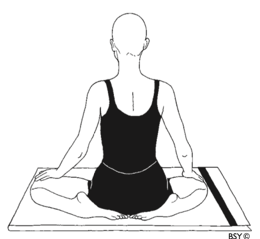
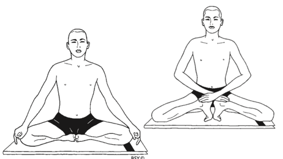

### ॥ ५३ ॥ गुल्फौ च वृषणस्याधः सीवन्याः पार्श्वयोः क्षिपेत् । सव्यगुल्फं तथा सव्ये दक्षगुल्फं तु दक्षिणे ॥

यह श्लोक **भद्रासन** (कल्याणकारी मुद्रा) की आधारभूत स्थिति का वर्णन करता है:

| श्लोक का अंश                     | हिंदी अर्थ                                                          |
|----------------------------------|---------------------------------------------------------------------|
| **गुल्फौ च वृषणस्याधः**          | दोनों टखनों (**गुल्फ**) को अंडकोष के नीचे रखें।                     |
| **सीवन्याः पार्श्वयोः क्षिपेत्** | उन्हें सीवन (Perineum) के दोनों **पार्श्वों (बगल)** में सटाकर रखें। |
| **सव्यगुल्फं तथा सव्ये**         | बाएं टखने को बाईं ओर रखें।                                          |
| **दक्षगुल्फं तु दक्षिणे**        | और दाएं टखने को दाईं ओर रखें (अर्थात पैरों को क्रॉस न करें)।        |

> टखनों को सीवन के पार्श्व में रखते समय तलवों को आपस में सटाकर रखें ताकि आधार मजबूत बने।
> सिंहासन के विपरीत, भद्रासन में टखनों को क्रॉस नहीं किया जाता, बल्कि उन्हें अपनी-अपनी दिशा के पार्श्व में स्थिर
> किया जाता है, जो कूल्हों और पेल्विक क्षेत्र की जकड़न को दूर करने में सहायक है।

### ॥ ५४ ॥ पाश्वर्पादौ च पाणिभ्यां दृढं बद्ध्वा सुनिश्चितम् । भद्रासनं भवेदेतत्सर्वव्याधिविनाशनम् । गोरक्षासनमित्याहुरिदं वै सिद्धयोगिनः ॥

यह श्लोक **भद्रासन** की पूर्णता और इसके एक अन्य प्रसिद्ध नाम का वर्णन करता है:

| श्लोक का अंश                 | हिंदी अर्थ                                                           |
|------------------------------|----------------------------------------------------------------------|
| **पाश्वर्पादौ च पाणिभ्यां**  | दोनों पैरों के पार्श्व भागों (किनारों) को दोनों हाथों (**पाणि**) से। |
| **दृढं बद्ध्वा सुनिश्चितम्** | मजबूती से पकड़कर स्थिर हो जाएं।                                       |
| **भद्रासनं भवेदेतत्**        | इसे ही **भद्रासन** कहा जाता है।                                      |
| **सर्वव्याधिविनाशनम्**       | यह सभी प्रकार के रोगों (**व्याधि**) को नष्ट करने वाला है।            |
| **गोरक्षासनमित्याहुरिदं**    | सिद्ध योगी इसे ही **गोरक्षासन** के नाम से पुकारते हैं।               |

> शारीरिक व्याधियों के निवारण और कुंडलिनी जागरण के प्रारंभिक अभ्यास के रूप में इस आसन को प्राथमिकता दें।
> इसे 'गोरक्षासन' इसलिए कहा जाता है क्योंकि यह गुरु गोरखनाथ द्वारा विशेष रूप से अनुशंसित है। यह आसन काम-ऊर्जा को
> नियंत्रित कर उसे ओज में बदलने की क्षमता रखता है।

## (7/8 group) मिताहार (आहार नियम) (55-63 / 67 श्लोक)

### ॥ ५५ ॥ एवमासनबंधेषु योगीन्द्रो विगतश्रमः । अभ्यसेन्नाडिकाशुद्धिं मुद्रादिपवनक्रियाम् ॥

यह श्लोक आसनों के अभ्यास और उसके अगले सोपान—प्राणायाम एवं मुद्रा—के बीच के संबंध को स्पष्ट करता है:

| श्लोक का अंश              | हिंदी अर्थ                                                                 |
|---------------------------|----------------------------------------------------------------------------|
| **एवमासनबंधेषु**          | इस प्रकार (बताए गए) आसनों और बंधों के अभ्यास से।                           |
| **योगीन्द्रो विगतश्रमः**  | जब श्रेष्ठ योगी की थकान (**श्रम**) पूरी तरह मिट जाए और शरीर स्थिर हो जाए।  |
| **अभ्यसेन्नाडिकाशुद्धिं** | तब उसे **नाड़ी शुद्धि** (प्राणायाम का प्रारंभिक चरण) का अभ्यास करना चाहिए। |
| **मुद्रादिपवनक्रियाम्**   | तथा विभिन्न मुद्राओं और **पवन क्रियाओं** (प्राणायाम) का अभ्यास करना चाहिए। |

> प्राणायाम शुरू करने से पहले आसनों में इतनी कुशलता प्राप्त करें कि शरीर में भारीपन या थकान न रहे।
> आसन केवल शरीर को लचीला बनाने के लिए नहीं हैं, बल्कि उनका उद्देश्य शरीर को इतना स्थिर और "श्रम-रहित" बनाना है
> कि साधक बिना किसी शारीरिक व्याकुलता के घंटों तक नाड़ी शुद्धि और प्राणायाम कर सके।

### ॥ ५६ ॥ आसनं कुंभकं चित्रं मुद्राख्यं करणं तथा । अथ नादानुसंधानमभ्यासानुक्रमो हठे ॥

यह श्लोक हठयोग की साधना के **क्रमबद्ध चरणों** (Hierarchy of Practice) को स्पष्ट करता है:

| श्लोक का अंश            | हिंदी अर्थ                                                            |
|-------------------------|-----------------------------------------------------------------------|
| **आसनं कुंभकं चित्रं**  | सर्वप्रथम **आसन**, उसके बाद विभिन्न प्रकार के **कुम्भक** (प्राणायाम)। |
| **मुद्राख्यं करणं तथा** | फिर **मुद्रा** और **करण** (बंध आदि) का अभ्यास करना चाहिए।             |
| **अथ नादानुसंधानम्**    | तत्पश्चात **नादानुसंधान** (आंतरिक ध्वनि का श्रवण) का स्थान आता है।    |
| **अभ्यासानुक्रमो हठे**  | हठयोग की साधना में यही **अभ्यास का सही क्रम** बताया गया है।           |

> अपनी योग साधना में इसी क्रम का पालन करें—पहले शरीर की स्थिरता (आसन), फिर प्राण का नियंत्रण (प्राणायाम), फिर
> ऊर्जा का संचय (मुद्रा), और अंत में ध्यान (नादानुसंधान)।
> हठयोग एक विज्ञान है जहाँ प्रत्येक चरण अगले चरण के लिए आधार तैयार करता है। बिना आसन की स्थिरता के प्राणायाम
> संभव नहीं, और बिना प्राण के नियंत्रण के नादानुसंधान (समाधि) प्राप्त नहीं किया जा सकता।

### ॥ ५७ ॥ ब्रह्मचारी मिताहारी त्यागी योगपरायणः । अब्दादूर्ध्वं भवेत्सिद्धो नात्र कार्या विचारणा ॥

यह श्लोक योग में सफलता (सिद्धि) प्राप्त करने के लिए अनिवार्य जीवनशैली और उसकी समय-सीमा को निर्धारित करता है:

| श्लोक का अंश                  | हिंदी अर्थ                                                                         |
|-------------------------------|------------------------------------------------------------------------------------|
| **ब्रह्मचारी मिताहारी**       | जो साधक **ब्रह्मचर्य** का पालन करता है और **मिताहारी** (संयमित भोजन लेने वाला) है। |
| **त्यागी योगपरायणः**          | जो सांसारिक आसक्तियों का **त्यागी** है और निरंतर **योग में लीन** रहता है।          |
| **अब्दादूर्ध्वं भवेत्सिद्धो** | वह **एक वर्ष (**अब्द**)** से कुछ अधिक समय में ही सिद्ध हो जाता है।                 |
| **नात्र कार्या विचारणा**      | इस विषय में किसी भी प्रकार का संदेह या विचार करने की आवश्यकता नहीं है।             |

> यदि आप शीघ्र सफलता चाहते हैं, तो तकनीक के साथ-साथ अपने आहार और आचरण (अनुशासन) पर समान रूप से ध्यान दें।
> योग केवल चटाई पर किया जाने वाला अभ्यास नहीं है, बल्कि एक पूर्ण जीवन पद्धति है। ब्रह्मचर्य ऊर्जा का संचय करता
> है और मिताहार शरीर को हल्का रखता है, जिससे एक वर्ष का निरंतर अभ्यास ही कायाकल्प और सिद्धि के लिए पर्याप्त हो जाता है।

### ॥ ५८ ॥ सुस्निग्धमधुराहाराश्र्चतुर्थांशविवर्जितः । भुज्यते शिवसंप्रीत्यै मिताहारः स उच्यते ॥

यह श्लोक **मिताहार** (संतुलित आहार) की सटीक वैज्ञानिक और आध्यात्मिक परिभाषा प्रस्तुत करता है:

| श्लोक का अंश              | हिंदी अर्थ                                                                     |
|---------------------------|--------------------------------------------------------------------------------|
| **सुस्निग्धमधुराहारास्**  | भोजन चिकना (घी/तेल युक्त) और **मधुर** (स्वाभाविक रूप से मीठा/ताजा) होना चाहिए। |
| **चतुर्थांशविवर्जितः**    | पेट का **चौथा हिस्सा (1/4)** खाली छोड़ देना चाहिए।                              |
| **भुज्यते शिवसंप्रीत्यै** | भोजन को 'शिव' (परमात्मा) को समर्पित भाव से ग्रहण करना चाहिए।                   |
| **मिताहारः स उच्यते**     | इसी प्रकार के खान-पान को **मिताहार** कहा जाता है।                              |

> पेट को कभी भी पूरा न भरें; आधा भोजन से, एक-चौथाई जल के लिए और शेष एक-चौथाई वायु के संचार के लिए रिक्त रखें।
> सुस्निग्ध भोजन नाड़ियों को कोमल बनाता है और मधुर आहार सात्त्विक ऊर्जा देता है। जब साधक पेट का एक हिस्सा खाली
> रखता है, तो प्राणायाम के दौरान वायु का भ्रमण सुगम होता है, जिससे आलस्य नहीं आता।

### ॥ ५९ ॥ कट्वम्लतीक्ष्णलवणोष्णहरीतशाकसौवीरतैलतिलसर्षप मद्यमत्स्यान । अजादिमांसदधितक्रकुलत्थकोलपिण्याकहिङ्गुलशुनाद्यमपथ्यमाहुः ॥

यह श्लोक योग साधना में बाधक और **असात्त्विक (अपथ्य)** आहार की एक विस्तृत सूची प्रदान करता है:

| श्रेणी           | वर्जित आहार (अपथ्य)                                                                                    |
|------------------|--------------------------------------------------------------------------------------------------------|
| **स्वाद/गुण**    | कड़वा (**कटु**), खट्टा (**अम्ल**), तीखा/तीक्ष्ण, अधिक नमकीन (**लवण**), और अत्यंत गर्म (**उष्ण**) भोजन। |
| **सब्जियाँ/तेल** | हरी पत्तेदार सब्जियाँ (अधिकता में), खट्टी कांजी (**सौवीर**), तेल, तिल और सरसों का तेल।                 |
| **मांसाहार/नशा** | मदिरा (**मद्य**), मछली (**मत्स्य**) और बकरी आदि का मांस।                                               |
| **डेयरी/दालें**  | दही, छाछ (**तक्र**), कुलथी की दाल और बेर (**कोल**)।                                                    |
| **अन्य**         | खली (**पिण्याक**), हींग और लहसुन (**लशुन**)।                                                           |

> यदि आप नाड़ी शुद्धि और प्राणायाम में प्रगति चाहते हैं, तो इन उत्तेजक और भारी पदार्थों का त्याग करें।
> ये पदार्थ शरीर में पित्त और राजस गुणों को बढ़ाते हैं, जिससे मन चंचल होता है और शरीर में उत्तेजना या भारीपन आता
> है। लहसुन और हींग जैसी चीजें वायु विकार और गंध के कारण ध्यान की सूक्ष्म अवस्थाओं में बाधा डालती हैं।

### ॥ ६० ॥ भोजनमहितं विद्यात्पुनरस्योष्णीकृतं रूक्षम् । अतिलवणमम्लयुक्तं कदशनशाकोत्कटं वर्ज्यम् ॥

यह श्लोक भोजन के उन दोषों का वर्णन करता है जो आहार को 'अहितकारी' बना देते हैं, भले ही वे सात्त्विक श्रेणी के क्यों न
हों:

| श्लोक का अंश              | हिंदी अर्थ                                                              |
|---------------------------|-------------------------------------------------------------------------|
| **पुनरस्योष्णीकृतं**      | एक बार पकने के बाद **दोबारा गर्म किया हुआ** भोजन।                       |
| **रूक्षम्**               | वह भोजन जो अत्यंत सूखा हो (जिसमें स्नेह या चिकनाई न हो)।                |
| **अतिलवणमम्लयुक्तं**      | जिसमें **नमक** बहुत अधिक हो या जो बहुत खट्टा (**अम्ल**) हो।             |
| **कदशनशाकोत्कटं**         | खराब तरीके से पका हुआ अन्न और **सब्जियों की अत्यधिक मात्रा** वाला भोजन। |
| **भोजनमहितं... वर्ज्यम्** | इन सभी को योग साधना में 'अहित' मानकर त्याग देना चाहिए।                  |

> ताज़ा और संतुलित भोजन ही ग्रहण करें; बासी या दोबारा गर्म किया हुआ भोजन प्राण शक्ति को कम करता है।
> दोबारा गर्म किया हुआ भोजन (Reheated food) अपने पोषक तत्व खो देता है और 'तामसिक' हो जाता है। साथ ही, केवल
> सब्जियों की अति (शाकोत्कट) पाचन तंत्र पर दबाव डालती है, जो प्राणायाम के लिए बाधक है।

### ॥ ६१ ॥ वह्निस्त्रीपथिसेवानामादौ वर्जनमाचरेत् । तथाहि गोरक्षवचनम् । ‘वर्जयेद् दुर्जनप्रान्तं वह्निस्त्रीपथिसेवनम् । प्रातःस्नानोपवासादि कायक्लेशविधिं तथा’ ॥

यह श्लोक योग साधना के आरंभ में उन बाहरी परिस्थितियों और शारीरिक कष्टों का वर्णन करता है जिन्हें 'बाधक तत्व' माना गया है:

| श्लोक का अंश                | हिंदी अर्थ                                                                              |
|-----------------------------|-----------------------------------------------------------------------------------------|
| **वह्निस्त्रीपथिसेवनाम्**   | अग्नि तापना (**वह्नि**), काम-संसर्ग (**स्त्री**) और लंबी पैदल यात्रा (**पथि**) का सेवन। |
| **वर्जनमाचरेत्**            | साधना के शुरुआती काल (**आदौ**) में इनका त्याग करना चाहिए।                               |
| **वर्जयेद् दुर्जनप्रान्तं** | दुष्ट लोगों की संगति और शोर-शराबे वाले स्थान से दूर रहना चाहिए।                         |
| **प्रातःस्नानोपवासादि**     | कड़ाके की ठंड में भोर का स्नान और अत्यधिक उपवास।                                        |
| **कायक्लेशविधिं तथा**       | शरीर को सुखाने या कष्ट देने वाली कठोर तपस्याओं का भी वर्जन करें।                        |

> साधना के प्रारंभिक चरण में मध्यम मार्ग अपनाएं; न तो अत्यधिक विलासिता में रहें और न ही शरीर को व्यर्थ कष्ट
> दें।
> अग्नि के समीप रहने से पित्त बढ़ता है, लंबी यात्रा से वायु का प्रकोप होता है, और कठोर उपवास से शरीर में कमजोरी
> आती है। ये सभी स्थितियां मन को विचलित करती हैं और प्राण की स्थिरता में बाधा डालती हैं।

### ॥ ६२ ॥ गोधूमशालियवषाष्टिकशोभनान्नंक्षीराज्यखंडनवनीतसितामधूनि । शुंठीपटोलकफलादिकपंचशाकंमुद्गादिदिव्यमुदकं च यमींद्रपथ्यम् ॥

यह श्लोक योगियों के लिए **पथ्य** (अनुकूल और श्रेष्ठ आहार) की सूची प्रस्तुत करता है, जो साधना में सहायक होते हैं:

| श्रेणी              | अनुशंसित आहार (पथ्य)                                                                                                                                                      |
|---------------------|---------------------------------------------------------------------------------------------------------------------------------------------------------------------------|
| **अनाज**            | गेहूँ (**गोधूम**), चावल (**शालि**), जौ (**यव**) और साठ दिन में पकने वाले विशेष चावल (**षाष्टिक**), वह अन्न जो देखने में सुंदर, शुद्ध और ठीक से पका हुआ हो(**शोभनान्नं**)। |
| **डेयरी/मिष्टान्न** | दूध (**क्षीर**), घी (**आज्य**), खांड/मिश्री, मक्खन (**नवनीत**) और शहद (**मधु**)।                                                                                          |
| **सब्जियाँ**        | सोंठ/सूखी अदरक (**शुंठी**), परवल (**पटोल**) और पाँच प्रकार की विशिष्ट साग (**पंचशाक** - जीवंती, बथुआ, चौलाई, मेघनाद और पुनर्नवा)।                                         |
| **दालें/जल**        | मूंग की दाल (**मुद्ग**) और शुद्ध/पवित्र वर्षा का जल या दिव्य जल(**दिव्यमुदकं**)।                                                                                          |
| **यमींद्रपथ्यम्**   | यह सब संयमी योगियों के लिए **पथ्य** (हितकारी) आहार है।                                                                                                                    |

> अपनी ऊर्जा को सात्त्विक और स्थिर रखने के लिए गेहूँ, दूध, घी और मूंग जैसे सुपाच्य खाद्यों को ही अपने भोजन का
> मुख्य हिस्सा बनाएँ।
> ये खाद्य पदार्थ शरीर में वात, पित्त और कफ का संतुलन बनाए रखते हैं। ये नाड़ियों को कोमल करते हैं और साधक की
> बुद्धि को सूक्ष्म बनाकर उच्च यौगिक क्रियाओं के लिए तैयार करते हैं।

### ॥ ६३ ॥ पुष्टं सुमधुरं स्निग्धं गव्यं धातुप्रपोषणम् । मनोभिलषितं योग्यं योगी भोजनमाचरेत् ॥

यह श्लोक योगी के लिए **भोजन के आदर्श गुणों** का सारांश प्रस्तुत करता है:

| श्लोक का अंश                | हिंदी अर्थ                                                                         |
|-----------------------------|------------------------------------------------------------------------------------|
| **पुष्टं सुमधुरं स्निग्धं** | भोजन पौष्टिक (**पुष्ट**), स्वाद में मीठा और घी/तेल युक्त (**स्निग्ध**) होना चाहिए। |
| **गव्यं धातुप्रपोषणम्**     | गाय के दूध-घी से निर्मित (**गव्य**) और शरीर की धातुओं को पोषण देने वाला हो।        |
| **मनोभिलषितं योग्यं**       | जो मन को प्रिय लगे (**मनोभिलषित**) और योग साधना के अनुकूल (**योग्य**) हो।          |
| **योगी भोजनमाचरेत्**        | योगी को इसी प्रकार के उत्तम भोजन का सेवन करना चाहिए।                               |

> केवल वही भोजन ग्रहण करें जो न केवल शरीर को ऊर्जा दे, बल्कि जिसे खाकर मन प्रसन्न और शांत रहे।
> योग साधना में शरीर की सप्त धातुओं का पोषण अनिवार्य है ताकि ओज बढ़ सके। जो भोजन मन को अरुचिकर लगता है, वह अक्सर
> तनाव पैदा करता है, जो एकाग्रता में बाधक है।

## (8/8 group) सफलता के सूत्र (64-67 / 67 श्लोक)

### ॥ ६४ ॥ युवा वृद्धोऽतिवृद्धो वा व्याधितो दुर्बलोऽपि वा । अभ्यासात्सिद्धिमाप्नोति सर्वयोगेष्वतंद्रितः ॥

यह श्लोक योग की सार्वभौमिकता और अभ्यास की शक्ति को रेखांकित करता है:

| श्लोक का अंश                | हिंदी अर्थ                                                           |
|-----------------------------|----------------------------------------------------------------------|
| **युवा वृद्धोऽतिवृद्धो वा** | चाहे साधक **युवा** हो, **वृद्ध** हो या अत्यंत वृद्ध ही क्यों न हो।   |
| **व्याधितो दुर्बलोऽपि वा**  | यदि वह **रोगी** (व्याधित) या शारीरिक रूप से **दुर्बल** भी हो।        |
| **अभ्यासात्सिद्धिमाप्नोति** | वह निरंतर अभ्यास के माध्यम से योग में **सिद्धि** प्राप्त कर लेता है। |
| **सर्वयोगेष्वतंद्रितः**     | बशर्ते वह आलस्य रहित (**अतंद्रित**) होकर सभी योग अंगों का पालन करे।  |

> शारीरिक सीमाओं को बाधा न मानें; योग में सफलता आयु या शक्ति पर नहीं, बल्कि निरंतरता (Consistency) पर निर्भर
> करती है।
> हठयोग एक यांत्रिक विज्ञान है। जैसे अग्नि सबको गर्मी देती है, वैसे ही सही विधि से किया गया अभ्यास किसी भी शरीर
> पर अपना प्रभाव दिखाता है, चाहे उसकी वर्तमान स्थिति कैसी भी हो।

### ॥ ६५ ॥ क्रियायुक्तस्य सिद्धिः स्यादक्रियस्य कथं भवेत् । न शास्त्रपाठमात्रेण योगसिद्धिः प्रजायते ॥

यह श्लोक योग साधना के सबसे महत्वपूर्ण सिद्धांत—**प्रायोगिक अभ्यास (Practical Application)**—पर बल देता है:

| श्लोक का अंश                      | हिंदी अर्थ                                                                |
|-----------------------------------|---------------------------------------------------------------------------|
| **क्रियायुक्तस्य सिद्धिः स्याद्** | सफलता केवल उसे ही मिलती है जो निरंतर **क्रिया (अभ्यास)** में लगा रहता है। |
| **अक्रियस्य कथं भवेत्**           | जो अभ्यास नहीं करता (अक्रिय है), उसे सिद्धि कैसे प्राप्त हो सकती है?      |
| **न शास्त्रपाठमात्रेण**           | केवल शास्त्रों को पढ़ने या कंठस्थ करने मात्र से।                           |
| **योगसिद्धिः प्रजायते**           | योग में सिद्धि या सफलता कभी प्राप्त नहीं होती।                            |

> योग के सिद्धांतों को केवल बौद्धिक स्तर पर समझने के बजाय, उन्हें अपने दैनिक शारीरिक और मानसिक अभ्यास में
> उतारें।
> योग एक अनुभवात्मक विज्ञान (Experiential Science) है। जैसे केवल नुस्खा पढ़ने से भूख नहीं मिटती, वैसे ही केवल योग
> ग्रंथों के ज्ञान से शारीरिक रूपांतरण या समाधि संभव नहीं है; इसके लिए 'क्रिया' अनिवार्य है।

### ॥ ६६ ॥ न वेषधारणं सिद्धेः कारणं न च तत्कथा । क्रियैव कारणं सिद्धेः सत्यमेतन्न संशयः ॥

यह श्लोक योग में सफलता के वास्तविक आधार को स्पष्ट करते हुए बाहरी दिखावे का खंडन करता है:

| श्लोक का अंश                 | हिंदी अर्थ                                                           |
|------------------------------|----------------------------------------------------------------------|
| **न वेषधारणं सिद्धेः कारणं** | विशेष प्रकार के वस्त्र (वेश) धारण करना सिद्धि का कारण नहीं है।       |
| **न च तत्कथा**               | न ही योग के विषय में केवल बड़ी-बड़ी बातें या चर्चाएँ करना।             |
| **क्रियैव कारणं सिद्धेः**    | केवल निरंतर और सही **क्रिया (अभ्यास)** ही सिद्धि का एकमात्र कारण है। |
| **सत्यमेतन्न संशयः**         | यह पूर्ण सत्य है और इसमें कोई संदेह नहीं है।                         |

> स्वयं को "योगी" दिखाने के बजाय अपना पूरा ध्यान अपने गुप्त अभ्यास और अनुशासन पर केंद्रित करें।
> गेरुए वस्त्र या जटाएँ धारण करने से शरीर के भीतर का प्राण नियंत्रित नहीं होता। हठयोग आंतरिक रूपांतरण की तकनीक
> है, जो केवल सक्रिय अभ्यास से ही संभव है, बाहरी आडंबरों से नहीं।

### ॥ ६७ ॥ पीठानि कुंभकाश्र्चित्रा दिव्यानि करणानि च । सर्वाण्यपि हठाभ्यासे राजयोगफलावधिः ॥

यह **हठयोग प्रदीपिका** के प्रथम उपदेश का अंतिम श्लोक है, जो हठयोग के संपूर्ण अभ्यासों के अंतिम लक्ष्य और फल को स्पष्ट
करता है:

| श्लोक का अंश                | हिंदी अर्थ                                                                |
|-----------------------------|---------------------------------------------------------------------------|
| **पीठानि कुंभकाश्र्चित्रा** | विभिन्न प्रकार के आसन (**पीठ**) और अनेक प्रकार के **कुम्भक** (प्राणायाम)। |
| **दिव्यानि करणानि च**       | दिव्य मुद्राएँ और **करण** (बंध आदि)।                                      |
| **सर्वाण्यपि हठाभ्यासे**    | हठयोग के अंतर्गत किए जाने वाले ये सभी अभ्यास।                             |
| **राजयोगफलावधिः**           | तब तक किए जाने चाहिए जब तक कि **राजयोग** (समाधि) का फल प्राप्त न हो जाए।  |

> हठयोग की शारीरिक क्रियाओं को साध्य न मानकर उन्हें राजयोग (परम चेतना) प्राप्त करने का साधन मात्र समझें।
> हठयोग का एकमात्र उद्देश्य शरीर और प्राण को इतना शुद्ध करना है कि साधक सहज ही राजयोग की अवस्था में प्रवेश कर
> सके। बिना राजयोग के लक्ष्य के, हठयोग केवल एक शारीरिक व्यायाम बनकर रह जाता है।

