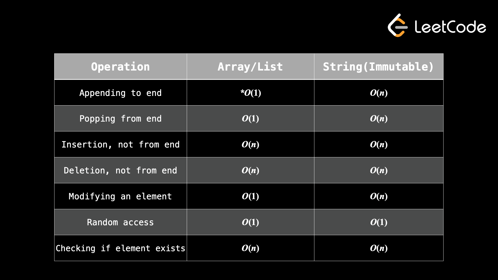
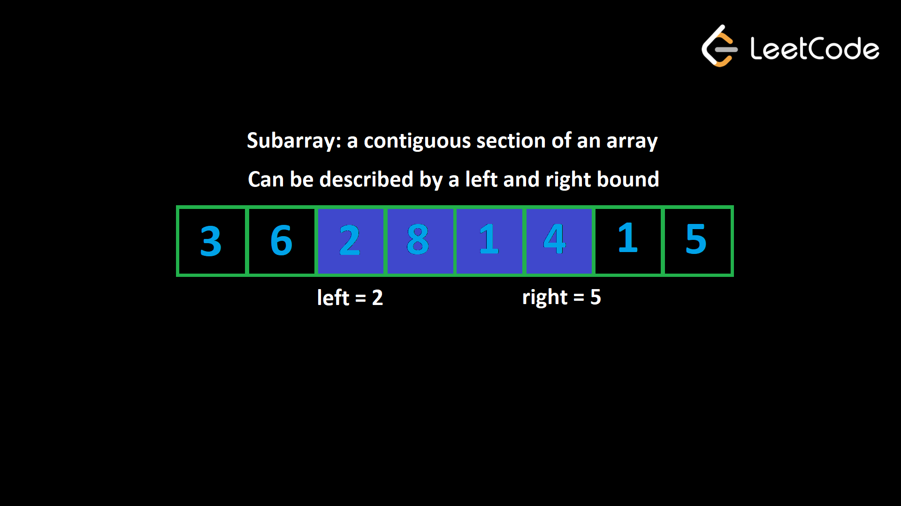
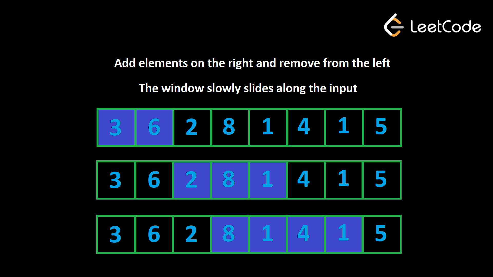
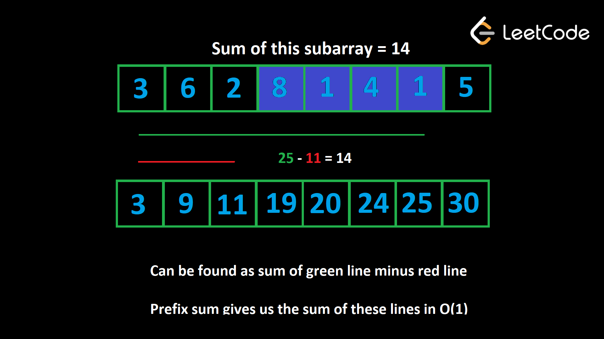

* In the context of algorithm problems, usually when people talk about arrays, they are referring to dynamic arrays.

### Time complexity of common array and string operations


> * Appending to the end of a list is [amortized O(1)](https://stackoverflow.com/questions/33044883/why-is-the-time-complexity-of-pythons-list-append-method-o1).

## 1. Two pointers technique
* Two pointers just refers to using two integer variables to move along some iterables.

* The integers are named something like _**(i and j)**_ or **_(left / right)_** or **_(start / end)_** which each represent an index of the array or string.
* There are several ways to implement two pointers.

### Single Input, Two Pointers
 1. **Opposite direction**: One pointer starts at the beginning of the array and the other starts at the end of the array. The two pointers move toward each other until they meet.
 2. **Same direction**: Both pointers start at the beginning of the array and move in the same direction, but at different speeds or with different conditions.

> **_Time: O(n), Space: O(1)_**

```javascript
function fn(arr):
    left = 0
    right = arr.length - 1

    while left < right:
        Do some logic here depending on the problem
        Do some more logic here to decide on one of the following:
            1. left++
            2. right--
            3. Both left++ and right--
```

### Multiple Inputs, Multiple Pointers
 1. Use multiple pointers to move along multiple inputs simultaneously until all elements have been checked.

> **_Time: O(n + m), Space: O(1)_**

```javascript
function fn(arr1, arr2):
    i = j = 0
    while i < arr1.length AND j < arr2.length:
        Do some logic here depending on the problem
        Do some more logic here to decide on one of the following:
            1. i++
            2. j++
            3. Both i++ and j++

    // Step 4: make sure both iterables are exhausted
    // Note that only one of these loops would run
    while i < arr1.length:
        Do some logic here depending on the problem
        i++

    while j < arr2.length:
        Do some logic here depending on the problem
        j++
```

## 2. Sliding Window Technique
* Sliding window is used to analyze and find the valid subarrays of an array.

### **Subarrays**
  * Given an array, a subarray is a contiguous section of the array. 
  * All the elements must be adjacent to each other in the original array and in their original order. 
  * It can be defined by two indices, the start and end. 
  * _Another name for subarray in this context is **"window"**._

### **"Valid" subarrays**
A common pattern you'll see in array problems involves the idea of a "valid" subarray. The problem description will either explicitly or implicitly define what makes a subarray "valid".
 1. **_A constraint metric_**. This is an attribute of a subarray. For example, the sum of the subarray, the number of unique elements in the subarray, the frequency of a specific element, etc.
 2. **_A numeric restriction_** on the constraint metric.

### Implementation of sliding window
* The idea behind a sliding window is to maintain two variables, `left` and `right` to represent the bounds of our window at any given time.
* `left++` means  remove the left-most element
* `right++` means add to the right
* As we add and remove elements, we are **"sliding"** our window along the input. 
* Then, we need to identify **_the constraint metric_**.
* The window's size is constantly changing 
  * it grows as large as it can until **_the numeric restriction_** is invalid, 
  * and then it shrinks until it's valid once more. 
* However, it always slides along to the right until it reaches the end of the input.

```javascript
function fn(arr):
    left = 0
    for (int right = 0; right < arr.length; right++):
        Do some logic to "add" element at arr[right] to window

        while WINDOW_IS_INVALID:
            Do some logic to "remove" element at arr[left] from window
            left++

        Do some logic to update the answer
```

### Number of subarrays
* If a problem asks for the number of subarrays that fit some constraint, we can still use sliding window, but we need to use a neat math trick to calculate the number of subarrays.

* Let's say that we are using the sliding window algorithm we have learned and currently have a window `(left, right)`. How many valid windows **end** at index `right`?

* There's the current window `(left, right)`, then `(left + 1, right)`, `(left + 2, right)`, and so on until `(right, right)` (only the element at `right`).

* You can fix the right bound and then choose any value between `left` and `right` inclusive for the left bound. Therefore, the number of valid windows **ending** at index `right` is equal to the size of the window, which we know is `(right - left + 1)`.

### Fixed window size
```javascript
function fn(arr, k):
    curr = some data to track the window

    // build the first window
    for (int i = 0; i < k; i++)
        Do something with curr or other variables to build first window

    ans = answer variable, probably equal to curr here depending on the problem
    for (int i = k; i < arr.length; i++)
        Add arr[i] to window
        Remove arr[i - k] from window
        Update ans

    return ans
```

## 3. Prefix sum technique
* A prefix sum is a great tool whenever a problem involves sums of a subarray. 
* It only costs `O(n)` to build but allows all future subarray queries to be `O(1)`, so it can usually improve an algorithm's time complexity by a factor of `O(n)`, where `n` is the length of the array.
* The idea is to create an array `prefix` where `prefix[i]` is the sum of all elements up to the index `i` (inclusive)
> When a subarray starts at index `0`, it is considered a **"prefix"** of the array. A prefix sum represents the sum of all prefixes.



```javascript
Given an array nums,

prefix = [nums[0]]
for (int i = 1; i < nums.length; i++)
    prefix.append(nums[i] + prefix[prefix.length - 1])
```

> Building a prefix sum is a form of **pre-processing**. Pre-processing is a useful strategy in a variety of problems where we store pre-computed data in a data structure before running the main logic of our algorithm. While it takes some time to pre-process, it's an investment that will save us a huge amount of time during the main parts of the algorithm.